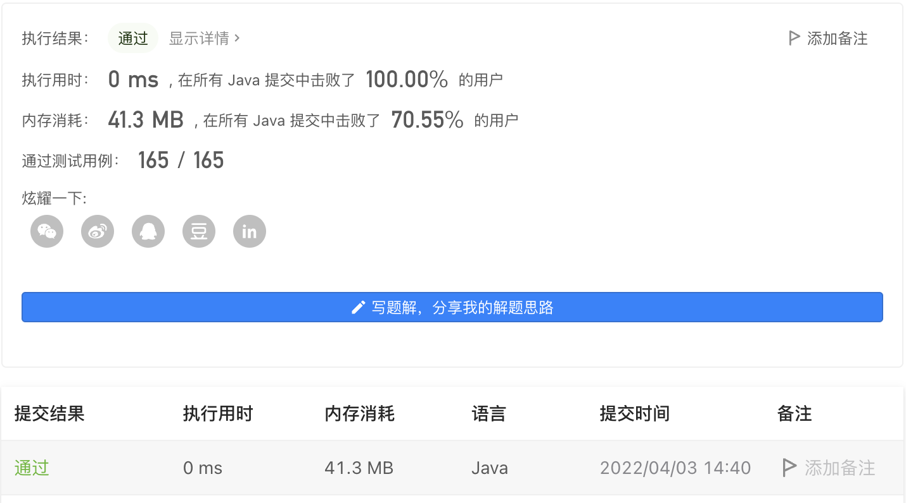

#### 744. 寻找比目标字母大的最小字母

#### 2022-04-03 LeetCode每日一题

链接：https://leetcode-cn.com/problems/find-smallest-letter-greater-than-target/

标签：**数组、二分查找**

> 题目

给你一个排序后的字符列表 letters ，列表中只包含小写英文字母。另给出一个目标字母 target，请你寻找在这一有序列表里比目标字母大的最小字母。

在比较时，字母是依序循环出现的。举个例子：

如果目标字母 target = 'z' 并且字符列表为 letters = ['a', 'b']，则答案返回 'a'


示例 1：

```java
输入: letters = ["c", "f", "j"]，target = "a"
输出: "c"
```

示例 2:

```java
输入: letters = ["c","f","j"], target = "c"
输出: "f"
```

示例 3:

```java
输入: letters = ["c","f","j"], target = "d"
输出: "f"
```


提示：

- 2 <= letters.length <= 10 ^ 4
- letters[i] 是一个小写字母
- letters 按非递减顺序排序
- letters 最少包含两个不同的字母
- target 是一个小写字母

> 分析

这个翻译真的是一言难尽啊。【在比较时，字母是依序循环出现的。举个例子：如果目标字母 target = 'z' 并且字符列表为 letters = ['a', 'b']，则答案返回 'a'】，这句话是个人能看得懂？

要不是看评论区还真没看懂，意思就是如果letters里的字母都没有target大的话，则返回letters中第一个字母。

使用二分查找即可。

> 编码

```java
class Solution {
    public char nextGreatestLetter(char[] letters, char target) {
        char ans = letters[0];
        int left = 0, right = letters.length;
        while (left < right) {
            int mid = left + (right - left) / 2;
            if (letters[mid] <= target) {
                left = mid + 1;
            } else {
                right = mid;
            }
        }

        if (right >= 0 && right < letters.length && letters[right] > target) {
            ans = letters[right];
        }
        return ans;
    }
}
```

