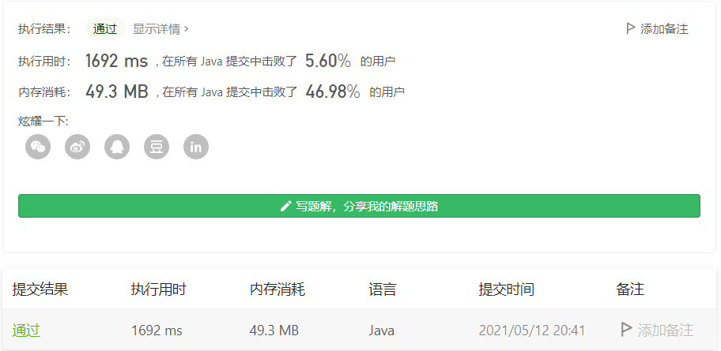
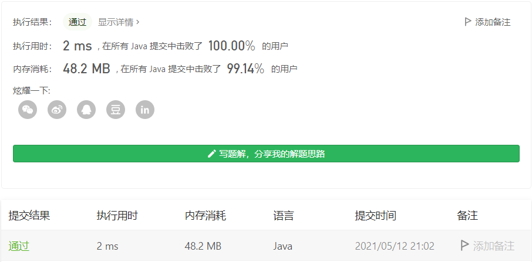

#### 1310. 子数组异或查询

链接：https://leetcode-cn.com/problems/xor-queries-of-a-subarray/

> 题目

有一个正整数数组 arr，现给你一个对应的查询数组 queries，其中 queries[i] = [Li, Ri]。

对于每个查询 i，请你计算从 Li 到 Ri 的 XOR 值（即 arr[Li] xor arr[Li+1] xor ... xor arr[Ri]）作为本次查询的结果。

并返回一个包含给定查询 queries 所有结果的数组。

```java
输入：arr = [1,3,4,8], queries = [[0,1],[1,2],[0,3],[3,3]]
输出：[2,7,14,8] 
解释：
数组中元素的二进制表示形式是：
1 = 0001 
3 = 0011 
4 = 0100 
8 = 1000 
查询的 XOR 值为：
[0,1] = 1 xor 3 = 2 
[1,2] = 3 xor 4 = 7 
[0,3] = 1 xor 3 xor 4 xor 8 = 14 
[3,3] = 8

输入：arr = [4,8,2,10], queries = [[2,3],[1,3],[0,0],[0,3]]
输出：[8,0,4,4]
    
1 <= arr.length <= 3 * 10^4
1 <= arr[i] <= 10^9
1 <= queries.length <= 3 * 10^4
queries[i].length == 2
0 <= queries[i][0] <= queries[i][1] < arr.length
```

> 分析

没啥好说的，直接写吧。

```java
class Solution {
    public int[] xorQueries(int[] arr, int[][] queries) {
        int len = queries.length;
        int[] res = new int[len];

        for (int i = 0; i < len; i++) {
            int a = queries[i][1];
            int b = queries[i][0];
            while (a >= b) {
                res[i] ^= arr[a--];
            }
        }

        return res;
    }
}
```

时间复杂度O(m * n)，空间复杂度O(n)。



emmm...感觉分分钟就要超时了。

本题还可以使用**前缀和**来求解。**利用异或运算中的「相同数值进行运算结果为 00」的特性。**对于数组，要求[a , b]区间的异或结果，可以通过[0, a - 1]和[0, b]的异或求得。

```java
class Solution {
    public int[] xorQueries(int[] arr, int[][] queries) {
        int len = queries.length, n = arr.length;
        int[] res = new int[len];
        int[] sum = new int[n + 1];

        for (int i = 1; i <= n; i++) {
            sum[i] = sum[i - 1] ^ arr[i - 1];
        }

        for (int i = 0; i < len; i++) {
            int a = queries[i][1];
            int b = queries[i][0];
            res[i] = sum[a + 1] ^ sum[b]; 
        }

        return res;
    }
}
```



时间复杂度：令 arr 数组长度为 n，queries数组的长度为 m。预处理前缀和数组复杂度为 O(n)；查询的复杂度为 O(m)。整体复杂度为 O(n + m)

空间复杂度：O(n)