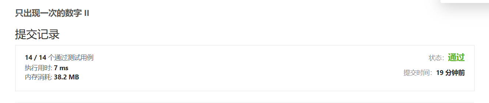
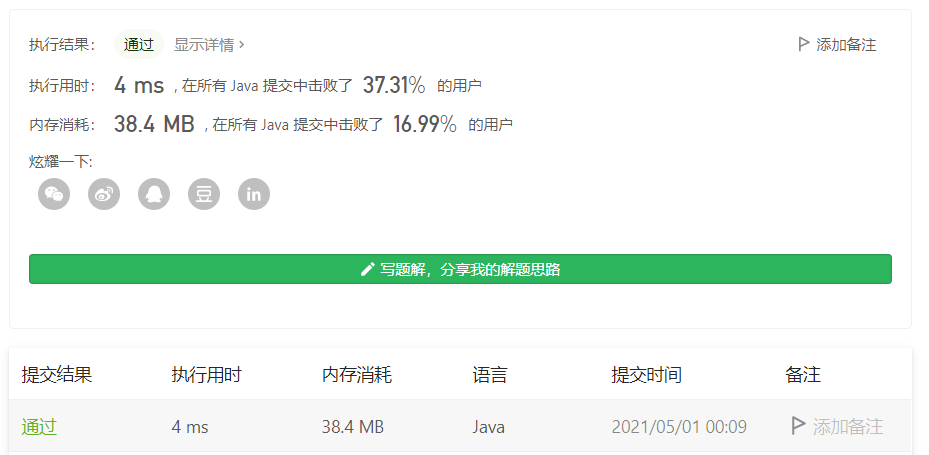

#### 137. 只出现一次的数字 II

链接：https://leetcode-cn.com/problems/single-number-ii/

方法1：使用map记录每个数出现的次数，再找出出现一次的数即可。

时间复杂度O(n)，空间复杂度O(n)

```java
class Solution {
    int res = 0;
    public int singleNumber(int[] nums) {
        Map<Integer, Integer> map = new HashMap<>();
        
        for (int num : nums) {
            map.put(num, map.getOrDefault(num, 0) + 1);
        }

        map.forEach((key, value) -> {
            if (value == 1) {
                res = key;
            }
        });

        return res;
    }
}
```



方法2：每位数转换为32位的二进制，使用一个长度为 32 的数组 cnt[]记录下所有数值的每一位共出现了多少次 1，再对 cnt[]数组的每一位进行 mod 3 操作，重新拼凑出只出现一次的数值。

考虑样例 [1,1,1,3]，1和 3 对应的二进制表示分别是 00..001 和 00..011，存入 cnt[] 数组后得到 [0,0,...,0,1,4]。进行 mod3 操作后得到 [0,0,...,0,1,1]，再转为十进制数字即可得「只出现一次」的答案 3。

时间复杂度O(n)，空间复杂度O(1)

```java
class Solution {
    public int singleNumber(int[] nums) {
        int[] count = new int[32];
        int len = nums.length, res = 0;
        
        for (int i = 0; i < len; i++) {
            for (int j = 0; j < 32; j++) {
                if (((nums[i] >> j) & 1) == 1) {
                    count[j]++;
                }
            } 
        }

        for (int i = 0; i < 32; i++) {
            if (count[i] % 3 == 1) {
                res += (1 << i);
            }
        }

        return res;
    }
}
```

