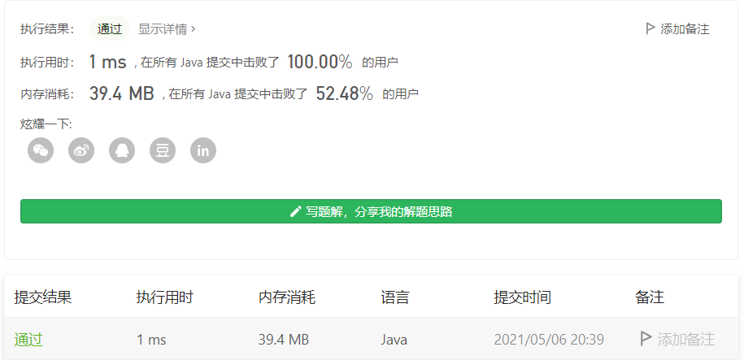

#### 1720. 解码异或后的数组

链接：https://leetcode-cn.com/problems/decode-xored-array/

> 题目

未知 整数数组 arr 由 n 个非负整数组成。

经编码后变为长度为 n - 1 的另一个整数数组 encoded ，其中 encoded[i] = arr[i] XOR arr[i + 1] 。例如，arr = [1,0,2,1] 经编码后得到 encoded = [1,2,3] 。

给你编码后的数组 encoded 和原数组 arr 的第一个元素 first（arr[0]）。

请解码返回原数组 arr 。可以证明答案存在并且是唯一的。

```java
输入：encoded = [1,2,3], first = 1
输出：[1,0,2,1]
解释：若 arr = [1,0,2,1] ，那么 first = 1 且 encoded = [1 XOR 0, 0 XOR 2, 2 XOR 1] = [1,2,3]
    
输入：encoded = [6,2,7,3], first = 4
输出：[4,2,0,7,4]
    
2 <= n <= 104
encoded.length == n - 1
0 <= encoded[i] <= 105
0 <= first <= 105
```

很容易可以发现，first作为原数组arr 的第一个数，arr[i + 1] = arr[i] ^ encoded[i] 。

```java
class Solution {
    public int[] decode(int[] encoded, int first) {
        int len = encoded.length;
        int[] res = new int[len + 1];
        res[0] = first;
        for (int i = 0; i < len; i++) {
            res[i + 1] = res[i] ^ encoded[i];
        }

        return res;
    }
}
```

