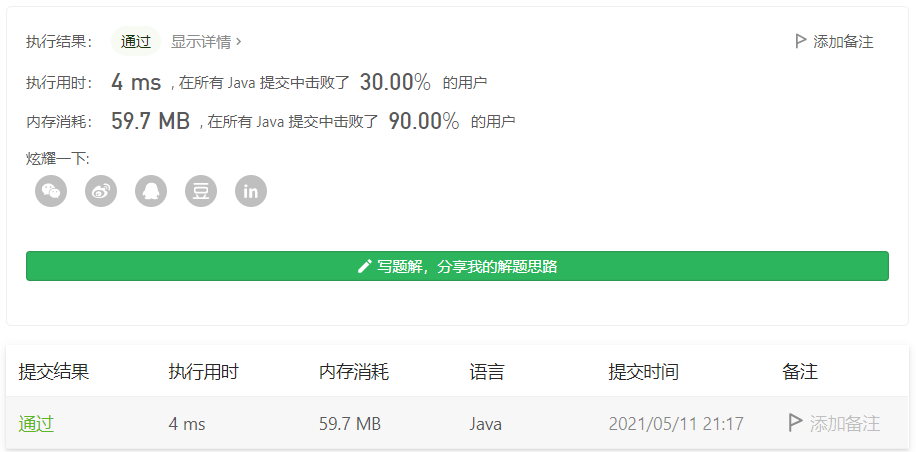

#### 1734. 解码异或后的排列

链接：https://leetcode-cn.com/problems/decode-xored-permutation/

> 题目

给你一个整数数组 perm ，它是前 n 个正整数的排列，且 n 是个 奇数 。

它被加密成另一个长度为 n - 1 的整数数组 encoded ，满足 encoded[i] = perm[i] XOR perm[i + 1] 。比方说，如果 perm = [1,3,2] ，那么 encoded = [2,1] 。

给你 encoded 数组，请你返回原始数组 perm 。题目保证答案存在且唯一。

```java
输入：encoded = [3,1]
输出：[1,2,3]
解释：如果 perm = [1,2,3] ，那么 encoded = [1 XOR 2,2 XOR 3] = [3,1]

输入：encoded = [6,5,4,6]
输出：[2,4,1,5,3]
    
3 <= n < 105
n 是奇数。
encoded.length == n - 1
```

> 分析

首先了解异或的特性

- 任何数和0进行异或，都等于它本身。
- 两个相同的数异或等于0。
- 异或具有交换性，即a ^ b = b ^ a。

对于长度为n的数组perm，[perm[0], perm[1], perm[2], ..., perm[n - 1]]，对于长度为n - 1的加密后的数组encoded，[perm[0] ^ perm[1], perm[1] ^ perm[2], perm[2] ^ perm[3], ..., perm[n - 2] ^ perm[n - 1]]。

那么如果encoded数组，相隔一个数进行异或，

（1）如果对于奇数项进行异或，就是

encoded[1] ^ encoded[3] ^ ... ^ encoded[n - 2] =  perm[1] ^ perm[2] ^ perm[3] ^ perm[4] ^ ... ^ perm[n - 2] ^ perm[n - 1]

除perm[0]外其他元素的异或结果。

（2）如果是对偶数项进行异或，就是

encoded[0] ^ encoded[2] ^ ... ^ encoded[n - 3] =  perm[0] ^ perm[1] ^ perm[2] ^ perm[3] ^ ... ^ perm[n - 3] ^ perm[n - 2]

除perm[n - 1]外其他元素的异或结果。

题目说**整数数组 perm ，它是前 n 个正整数的排列**，所以我们可以得到perm所有数的全排列结果为

1 ^ 2 ^ 3 ^ ... ^ n

然后再和上面求得的排列进行异或，就可以得到perm[0]或者perm[n - 1]的值。

拿到perm[0]或者perm[n - 1]的后，就好办了。如果拿到的是perm[0]，那么perm[i + 1] = perm[i] ^ encoded[i] (i >= 0)。如果拿到的是perm[n - 1]，那么perm[i - 1] = perm[i] ^ encoded[i - 1] (i <= n - 1)。

下面的代码是已知perm[0]的情形

```java
class Solution {
    public int[] decode(int[] encoded) {
        int len = encoded.length + 1;
        int[] res = new int[len];
        res[0] = 1;

        for (int i = 2; i <= len; i++) {
            res[0] ^= i;
        }


        for (int i = 1; i < len - 1; i += 2) {
            res[0] ^= encoded[i];
        }

        for (int i = 1; i < len; i++) {
            res[i] = res[i - 1] ^ encoded[i - 1];
        }

        return res;
    }
}
```

