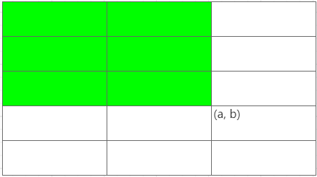
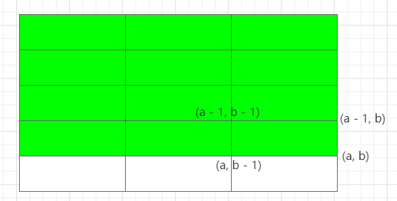
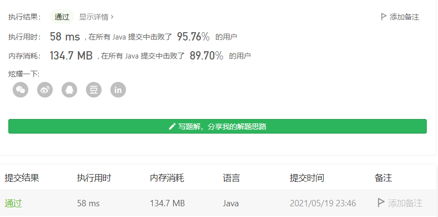

#### 1738. 找出第 K 大的异或坐标值

链接：https://leetcode-cn.com/problems/find-kth-largest-xor-coordinate-value/

标签：**数组、位运算、二维前缀和**

> 题目

给你一个二维矩阵 matrix 和一个整数 k ，矩阵大小为 m x n 由非负整数组成。

矩阵中坐标 (a, b) 的 值 可由对所有满足 0 <= i <= a < m 且 0 <= j <= b < n 的元素 matrix[i][j]（下标从 0 开始计数）执行异或运算得到。

请你找出 matrix 的所有坐标中第 k 大的值（k 的值从 1 开始计数）。

```java
输入：matrix = [[5,2],[1,6]], k = 1
输出：7
解释：坐标 (0,1) 的值是 5 XOR 2 = 7 ，为最大的值。
    
输入：matrix = [[5,2],[1,6]], k = 2
输出：5
解释：坐标 (0,0) 的值是 5 = 5 ，为第 2 大的值。
    
输入：matrix = [[5,2],[1,6]], k = 3
输出：4
解释：坐标 (1,0) 的值是 5 XOR 1 = 4 ，为第 3 大的值。
    
输入：matrix = [[5,2],[1,6]], k = 4
输出：0
解释：坐标 (1,1) 的值是 5 XOR 2 XOR 1 XOR 6 = 0 ，为第 4 大的值。

m == matrix.length
n == matrix[i].length
1 <= m, n <= 1000
0 <= matrix[i][j] <= 106
1 <= k <= m * n
```

> 分析

由题意可知，坐标(a, b)的值其实就是该点的左上角区域所有数的亦或值。



即图中绿色区域的部分。定义任何一点(a, b)的值为values[i][j]，那么对于任何一点(a, b)，它的值为

values[i] [j] = values[i - 1] [j] ^ values[i] [j - 1] ^ values[i - 1] [j - 1] ^ matrix[i - 1] [j - 1]



接下来的如何去实现了，对于每个坐标的亦或值，可以利用**二维前缀和**，用一个二维数组迭代求值，然后把每个值放入一个一维数组，最后对一维数组排序，拿到第K大的值即可。

一开始我的想法是利用一个TreeSet去存储异或值，因为TreeSet能帮我们排序，后来发现Set不能存储重复元素，所以不太好弄，就换成了一维数组。

```java
class Solution {
    public int kthLargestValue(int[][] matrix, int k) {
        int m = matrix.length, n = matrix[0].length, count = 0;
        int[][] values = new int[m + 1][n + 1];
        int[] res = new int[m * n];

        for (int i = 1; i <= m; i++) {
            for (int j = 1; j <= n; j++) {
                values[i][j] = (values[i][j - 1] ^ values[i - 1][j] ^ values[i - 1][j - 1] ^ matrix[i - 1][j - 1]);
                res[count++] = values[i][j];
            }
        }

        // 升序数组
        Arrays.sort(res);

        return res[res.length - k];
    }
}
```

时间复杂度O(m * n)，空间复杂度O(m * n)

