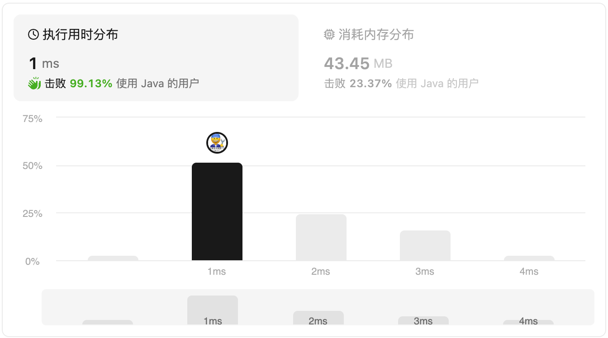

#### 2859. 计算 K 置位下标对应元素的和

#### 2024-01-26 LeetCode每日一题

链接：https://leetcode.cn/problems/sum-of-values-at-indices-with-k-set-bits/

标签：**位运算、数组**

> 题目

给你一个下标从 **0** 开始的整数数组 `nums` 和一个整数 `k` 。

请你用整数形式返回 `nums` 中的特定元素之 **和** ，这些特定元素满足：其对应下标的二进制表示中恰存在 `k` 个置位。

整数的二进制表示中的 1 就是这个整数的 **置位** 。

例如，`21` 的二进制表示为 `10101` ，其中有 `3` 个置位。

**示例 1：**

```
输入：nums = [5,10,1,5,2], k = 1
输出：13
解释：下标的二进制表示是： 
0 = 0002
1 = 0012
2 = 0102
3 = 0112
4 = 1002 
下标 1、2 和 4 在其二进制表示中都存在 k = 1 个置位。
因此，答案为 nums[1] + nums[2] + nums[4] = 13 。
```

**示例 2：**

```
输入：nums = [4,3,2,1], k = 2
输出：1
解释：下标的二进制表示是： 
0 = 002
1 = 012
2 = 102
3 = 112
只有下标 3 的二进制表示中存在 k = 2 个置位。
因此，答案为 nums[3] = 1 。
```

**提示：**

- `1 <= nums.length <= 1000`
- `1 <= nums[i] <= 105`
- `0 <= k <= 10`

> 编码

```java
class Solution {
    public int sumIndicesWithKSetBits(List<Integer> nums, int k) {
        int res = 0;
        for (int i = 0; i < nums.size(); i++) {
            int count = 0;
            int index = i;
            while (index != 0) {
                index &= (index - 1);
                count++;
            }
            if (count == k) {
                res += nums.get(i);
            }
        }

        return res;
    }
}
```



```go
func sumIndicesWithKSetBits(nums []int, k int) int {
    res := 0
    for i, num := range nums {
        if bits.OnesCount(uint(i)) == k {
            res += num
        }
    }

    return res
}
```

