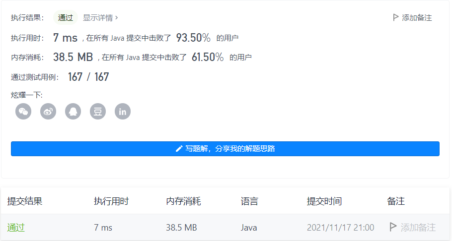

#### 318. 最大单词长度乘积

#### 2021-11-17 LeetCode每日一题

链接：https://leetcode-cn.com/problems/maximum-product-of-word-lengths/

标签：**位运算、数组、字符串**

> 题目

给定一个字符串数组 words，找到 length(word[i]) * length(word[j]) 的最大值，并且这两个单词不含有公共字母。你可以认为每个单词只包含小写字母。如果不存在这样的两个单词，返回 0。

示例 1:

```java
输入: ["abcw","baz","foo","bar","xtfn","abcdef"]
输出: 16 
解释: 这两个单词为 "abcw", "xtfn"。
```

示例 2:

```java
输入: ["a","ab","abc","d","cd","bcd","abcd"]
输出: 4 
解释: 这两个单词为 "ab", "cd"。
```

示例 3:

```java
输入: ["a","aa","aaa","aaaa"]
输出: 0 
解释: 不存在这样的两个单词。
```


提示：

- 2 <= words.length <= 1000
- 1 <= words[i].length <= 1000
- words[i] 仅包含小写字母

> 分析

可以把每个字符串转换为二进制表示，这样在比较两个字符串是否含有相同字符时，只需要进行&运算即可。

> 编码

```java
class Solution {
    public int maxProduct(String[] words) {
        int ans = 0;
        int[] nums = new int[words.length];
        for (int i = 0; i < words.length; i++) {
            String str = words[i];
            int res = 0;
            // 将str转为二进制
            for (int j = 0; j < str.length(); j++) {
                res |= (1 << (str.charAt(j) - 'a'));
            }
            nums[i] = res;   
        }

        for (int i = 0; i < words.length; i++) {
            for (int j = i + 1; j < words.length; j++) {
                if ((nums[i] & nums[j]) == 0) {
                    ans = Math.max(ans, words[i].length() * words[j].length());
                }
            }
        }

        return ans;
    }
}
```

