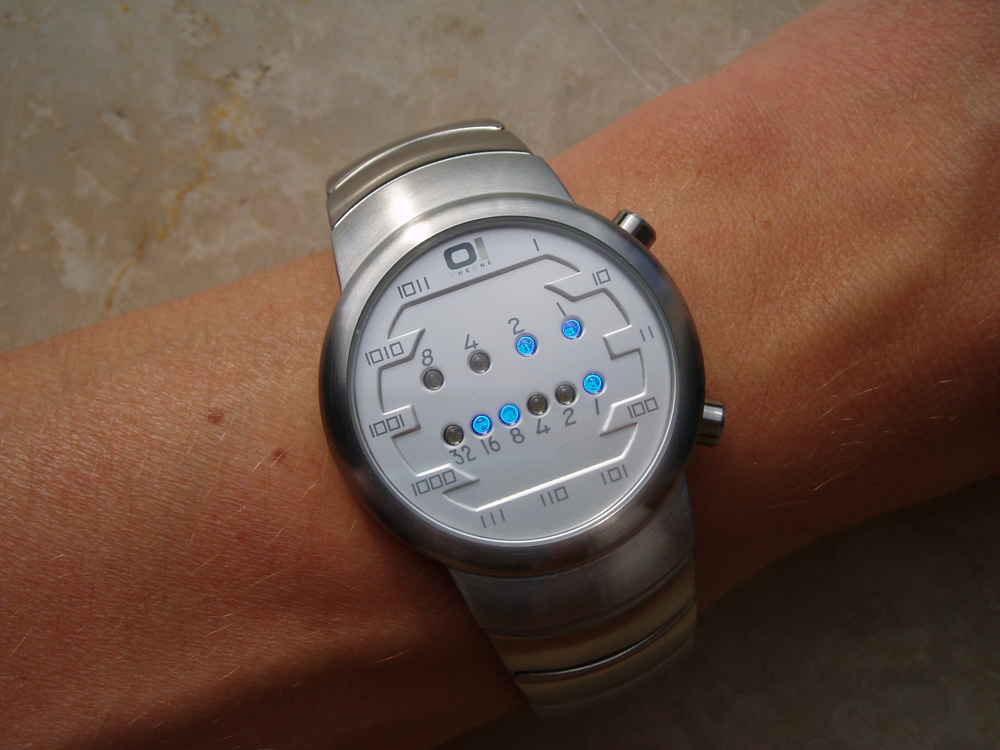

#### 401. 二进制手表

#### 2021-06-21 LeetCode每日一题

链接：https://leetcode-cn.com/problems/binary-watch/

标签：**位运算、回溯**

> 题目

二进制手表顶部有 4 个 LED 代表 小时（0-11），底部的 6 个 LED 代表 分钟（0-59）。每个 LED 代表一个 0 或 1，最低位在右侧。

例如，下面的二进制手表读取 "3:25" 。



（图源：WikiMedia - Binary clock samui moon.jpg ，许可协议：Attribution-ShareAlike 3.0 Unported (CC BY-SA 3.0) ）

给你一个整数 turnedOn ，表示当前亮着的 LED 的数量，返回二进制手表可以表示的所有可能时间。你可以 按任意顺序 返回答案。

小时不会以零开头：

- 例如，"01:00" 是无效的时间，正确的写法应该是 "1:00" 。

分钟必须由两位数组成，可能会以零开头：

- 例如，"10:2" 是无效的时间，正确的写法应该是 "10:02" 。

```java
输入：turnedOn = 1
输出：["0:01","0:02","0:04","0:08","0:16","0:32","1:00","2:00","4:00","8:00"]

输入：turnedOn = 9
输出：[]
```

**提示：**

- `0 <= turnedOn <= 10`

> 分析

此题既然标为简单题，tag却是回溯，十分不合理，连官方题解都没有提及回溯算法。


这里可以换个思路，那就是计算时和分加起来总共有几个灯亮（即有几个1），如果个数等于turnedOn，那就是一个结果。因为数字不是很大，所以可以暴力。

对于一个数n，n & (n - 1)，会让n最低位的1变成0。比如n = 10(1010)，n - 1 = 9(1001)，那么n & (n - 1)就等于8(1000)。而8 & 7 = 1000 & 0111 = 0000，所以利用此特性，可以快速得到n表示的二进制有几个1。

Java有现成的API可以调用Integer.bitCount()，这里只是讲一下过程。

> 编码

```java
class Solution {
    public List<String> readBinaryWatch(int turnedOn) {
        List<String> list = new ArrayList<>();
        for (int i = 0; i < 12; i++) {
            for (int j = 0; j < 60; j++) {
                if (countBit(i) + countBit(j) == turnedOn) {
                    list.add(i + ":" + (j < 10 ? ("0" + j) : j));
                }
            }
        }

        return list;
    }

    /**
     * 计算num表示的二进制有几个1
     */
    private int countBit(int num) {
        int count = 0;
        while (num != 0) {
            num = num & (num - 1);
            count++;
        }

        return count;
    }
}
```

