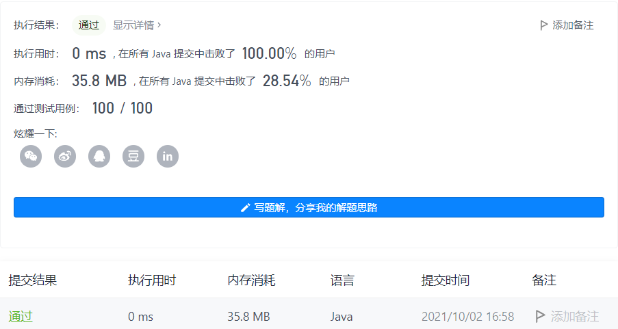

#### 405. 数字转换为十六进制数

#### 2021-10-02 LeetCode每日一题

链接：https://leetcode-cn.com/problems/convert-a-number-to-hexadecimal/

标签：**位运算、数学**

> 题目

给定一个整数，编写一个算法将这个数转换为十六进制数。对于负整数，我们通常使用 补码运算 方法。

注意:

- 十六进制中所有字母(a-f)都必须是小写。
- 十六进制字符串中不能包含多余的前导零。如果要转化的数为0，那么以单个字符'0'来表示；对于其他情况，十六进制字符串中的第一个字符将不会是0字符。 
- 给定的数确保在32位有符号整数范围内。
- 不能使用任何由库提供的将数字直接转换或格式化为十六进制的方法。

示例 1：

```java
输入:
26

输出:
"1a"
```

示例 2：

```java
输入:
-1

输出:
"ffffffff"
```

> 分析

解法1：对num进行%16，余数组成的字符串进行反转。对于负数需要先转为补码，直接加上2 ^ 32次方即可。

解法2：(1111)2范围为[0, 15]，可以表示一位16进制数。所以可以对num不断取低4位转为16进制即可。

> 编码

解法1：

```java
class Solution {
    public String toHex(int num) {
        if (num == 0) {
            return "0";
        }
        StringBuilder sb = new StringBuilder();
        long n = num;
        if (n < 0) {
            // 负数加上2 ^ 32，转换为补码
            n = n + (long)Math.pow(2, 32);
        }
        
        while (n > 0) {
            long mod = n % 16;
            char c = (char)(mod + '0');
            if (mod >= 10) {
                c = (char)(mod - 10 + 'a');
            }
            sb.append(c);
            n /= 16;
        }

        return sb.reverse().toString();
    }
}
```



时间复杂度O(N)，N为循环的次数，固定为8次。空间复杂度O(N)，N为循环的次数，固定为8次。

解法2：

```java
class Solution {
    public String toHex(int num) {
        if (num == 0) {
            return "0";
        }
        StringBuilder sb = new StringBuilder();
        while (num != 0) {
            int val = num & 0xf;
            char c = (char)(val + '0');
            if (val >= 10) {
                c = (char)(val - 10 + 'a');
            }
            sb.append(c);
            // 无符号右移,左侧用0填充
            num >>>= 4;
        }

        return sb.reverse().toString();
    }
}
```


时间复杂度O(N)，N为循环的次数，固定为8次。空间复杂度O(N)，N为循环的次数，固定为8次。