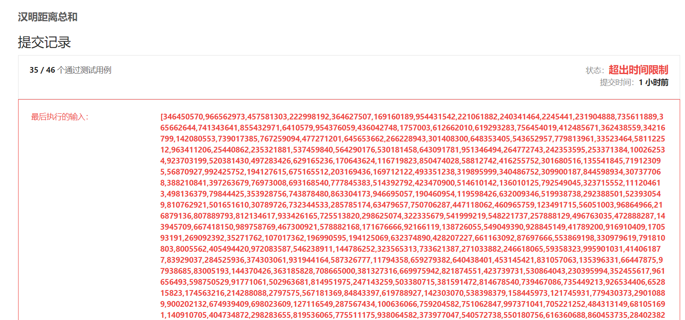

#### 477. 汉明距离总和

#### 2021-05-28 LeetCode每日一题

链接：https://leetcode-cn.com/problems/total-hamming-distance/

标签：**位运算**

> 题目

两个整数的 [汉明距离](https://baike.baidu.com/item/汉明距离/475174?fr=aladdin) 指的是这两个数字的二进制数对应位不同的数量。

计算一个数组中，任意两个数之间汉明距离的总和。

```java
输入: 4, 14, 2

输出: 6

解释: 在二进制表示中，4表示为0100，14表示为1110，2表示为0010。（这样表示是为了体现后四位之间关系）
所以答案为：
HammingDistance(4, 14) + HammingDistance(4, 2) + HammingDistance(14, 2) = 2 + 2 + 2 = 6.

数组中元素的范围为从 0到 10^9。
数组的长度不超过 10^4。
```

> 解析

暴力破解，直接人没了。



所以不能暴力破解。观察规律

```java
4   14   2
0 1 0 0   
1 1 1 0    
0 0 1 0
第一位有3个0
第二位有1个0和2个1
第三位有2个1和1个0
第四位有2个0和1个1
所以这三个数的汉明距离总和就是1 * 2 + 2 * 1 + 2 * 1 = 6
即等于所有位0和1个数相乘的总和
```

> 编码

```java
class Solution {
    public int totalHammingDistance(int[] nums) {
        int res = 0, len = nums.length;
        for (int i = 0; i < 32; i++) {
            int[] count = new int[2];
            // 计算所有数的第i位有几个1和几个0
            for (int j = 0; j < len; j++) {
                count[((nums[j] >> i) & 1)]++;
            }

            res += (count[0] * count[1]);
        }
        
        return res;
    }
}
```


时间复杂度O(C * n)，C为数的位数，这里为32，空间复杂度O(1)