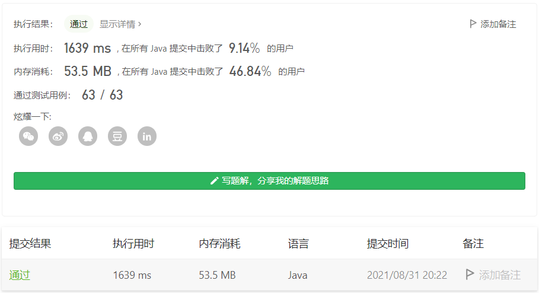
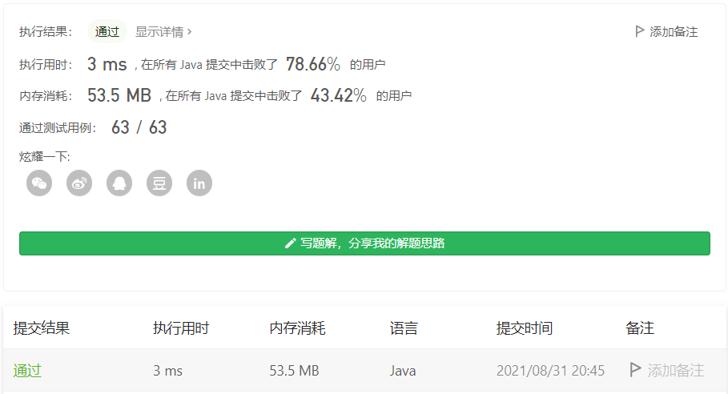

#### 1109. 航班预订统计

#### 2021-08-31 LeetCode每日一题

链接：https://leetcode-cn.com/problems/corporate-flight-bookings/

标签：**数组、前缀和**

> 题目

这里有 n 个航班，它们分别从 1 到 n 进行编号。

有一份航班预订表 bookings ，表中第 i 条预订记录 bookings[i] = [firsti, lasti, seatsi] 意味着在从 firsti 到 lasti （包含 firsti 和 lasti ）的 每个航班 上预订了 seatsi 个座位。

请你返回一个长度为 n 的数组 answer，其中 answer[i] 是航班 i 上预订的座位总数。

示例 1：

```java
输入：bookings = [[1,2,10],[2,3,20],[2,5,25]], n = 5
输出：[10,55,45,25,25]
解释：
航班编号        1   2   3   4   5
预订记录 1 ：   10  10
预订记录 2 ：       20  20
预订记录 3 ：       25  25  25  25
总座位数：      10  55  45  25  25
因此，answer = [10,55,45,25,25]
```

示例 2：

```java
输入：bookings = [[1,2,10],[2,2,15]], n = 2
输出：[10,25]
解释：
航班编号        1   2
预订记录 1 ：   10  10
预订记录 2 ：       15
总座位数：      10  25
因此，answer = [10,25]
```


提示：

- 1 <= n <= 2 * 10 ^ 4
- 1 <= bookings.length <= 2 * 10 ^ 4
- bookings[i].length == 3
- 1 <= firsti <= lasti <= n
- 1 <= seatsi <= 10 ^ 4

> 分析

方法1：普通循环。

方法2：前缀和。前缀和主要是为了防止重复计算，比如要求数组[i, j]区间所有的元素和，利用前缀和数组sum[j + 1] - sum[i]即可求出。**前缀和适用于原数组元素不变的情况下，可以快速求出某段区间的和**。但这题的区间和其实是一直在变 的，因为预定的座位不一样，所以这里需要使用**差分数组**。

**差分数组适用于元素频繁变动的情况下，求某段区间的和**。差分数组和前缀和数组相反，前缀和数组是求和，而差分数组是求差。

对于数组n = [1, 3, 8, 6, 2]，差分数组num = [1, 2, 5, -2, -4]，即num[i] = n[i] - n[i - 1]。通过差分数组可以反推出原数组

```java
num = [1, 2, 5, -2, -4]
n = [1, 3, 8, 6, 2]
for (int i = 1; i < 5; i++) {
    n[i] = n[i - 1] + num[i]
}
```

对于本题，初始时answer[i] = [0, 0, 0, 0, ...., 0]，差分数组num = [0, 0, 0, 0, ...., 0]，此时假设2-5号航班都加上10，只需要让差分数组num[2 - 1] += 10，num[5] -= 10即可。此时差分数组变成num = [0, 10, 0, 0, 0, -10, 0, ... , 0]。反推原数组的时候，2-5号航班(对应下标1-4)的值就全部加上10了。-10是为了让消除前面的数，让后面的数保持不变。

> 编码

**普通循环**：

```java
class Solution {
    public int[] corpFlightBookings(int[][] bookings, int n) {
        int[] res = new int[n];
        for (int i = 0; i < bookings.length; i++) {
            for (int j = bookings[i][0]; j <= bookings[i][1]; j++) {
                res[j - 1] += bookings[i][2];
            }
        }

        return res;
    }
}
```



**前缀和**：

```java
class Solution {
    public int[] corpFlightBookings(int[][] bookings, int n) {
        int[] res = new int[n];
        for (int i = 0; i < bookings.length; i++) {
            res[bookings[i][0] - 1] += bookings[i][2];
            if (bookings[i][1] < n) {
                res[bookings[i][1]] -= bookings[i][2];
            }
        }

        for (int i = 1; i < n; i++) {
            res[i] += res[i - 1];
        }

        return res;
    }
}
```

