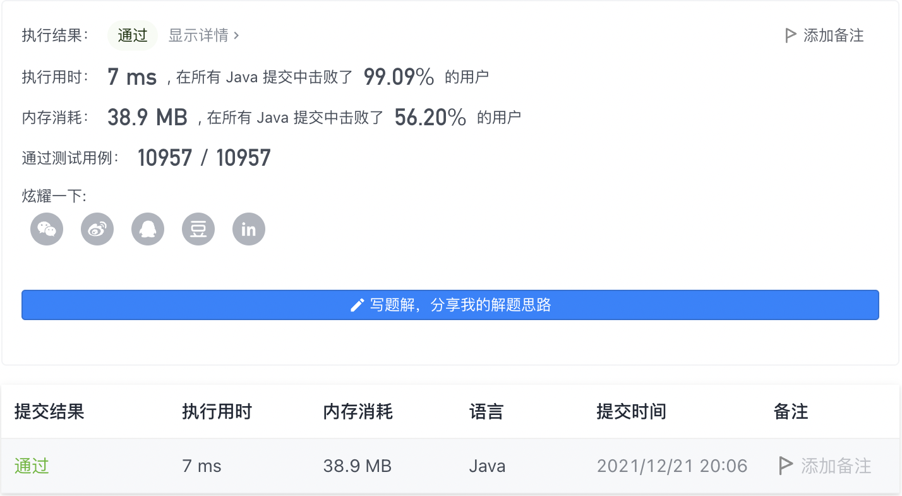

#### 1154. 一年中的第几天

#### 2021-12-21 LeetCode每日一题

链接：https://leetcode-cn.com/problems/day-of-the-year/

标签：**数学、数组、前缀和**

> 题目

给你一个字符串 date ，按 YYYY-MM-DD 格式表示一个 现行公元纪年法 日期。请你计算并返回该日期是当年的第几天。

通常情况下，我们认为 1 月 1 日是每年的第 1 天，1 月 2 日是每年的第 2 天，依此类推。每个月的天数与现行公元纪年法（格里高利历）一致。

示例 1：

```java
输入：date = "2019-01-09"
输出：9
```

示例 2：

```java
输入：date = "2019-02-10"
输出：41
```

示例 3：

```java
输入：date = "2003-03-01"
输出：60
```

示例 4：

```java
输入：date = "2004-03-01"
输出：61
```


提示：

- date.length == 10
- date[4] == date[7] == '-'，其他的 date[i] 都是数字
- date 表示的范围从 1900 年 1 月 1 日至 2019 年 12 月 31 日

> 分析

首先判断是平年还是闰年，闰年能够被4整除并且不能被100整除，或者能被400整除。闰年2月份有29天，平年2月份有28天。然后再累加月份，最后加上哪一天即可。

> 编码

```java
class Solution {
    public int dayOfYear(String date) {
        Integer year = Integer.parseInt(date.substring(0, 4));
        Integer month = Integer.parseInt(date.substring(5, 7));
        Integer day = Integer.parseInt(date.substring(8, 10));
        int ans = 0;

        int two = 28;
        // 闰年
        if ((year % 4 == 0 && year % 100 != 0) || year % 400 == 0) {
            two = 29;
        }
        int[] days = {31, two, 31, 30, 31, 30, 31, 31, 30, 31, 30, 31};
        for (int i = 0; i < month - 1; i++) {
            ans += days[i];
        }

        return ans + day;
    }
}
```

