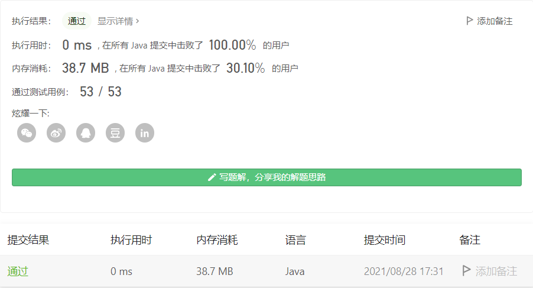

#### 1480. 一维数组的动态和

#### 2021-08-28 LeetCode每日一题

链接：https://leetcode-cn.com/problems/running-sum-of-1d-array/

标签：**数组、前缀和**

> 题目

给你一个数组 nums 。数组「动态和」的计算公式为：runningSum[i] = sum(nums[0]…nums[i]) 。

请返回 nums 的动态和。

示例 1：

```java
输入：nums = [1,2,3,4]
输出：[1,3,6,10]
解释：动态和计算过程为 [1, 1+2, 1+2+3, 1+2+3+4] 。
```

示例 2：

```java
输入：nums = [1,1,1,1,1]
输出：[1,2,3,4,5]
解释：动态和计算过程为 [1, 1+1, 1+1+1, 1+1+1+1, 1+1+1+1+1] 。
```

示例 3：

```java
输入：nums = [3,1,2,10,1]
输出：[3,4,6,16,17]
```


提示：

- 1 <= nums.length <= 1000
- -10^6 <= nums[i] <= 10^6

> 分析

累加求和即可。不过直接修改原数组空间击败率竟然才30%。。魔鬼

> 编码

```java
class Solution {
    public int[] runningSum(int[] nums) {
        for (int i = 1; i < nums.length; i++) {
            nums[i] = nums[i - 1] + nums[i];
        }
        return nums;
    }
}
```

