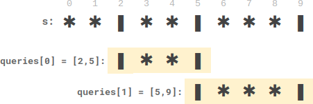
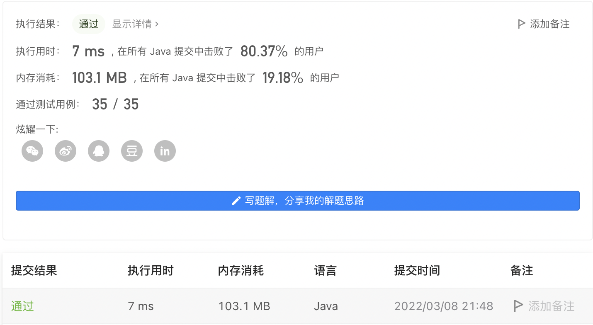
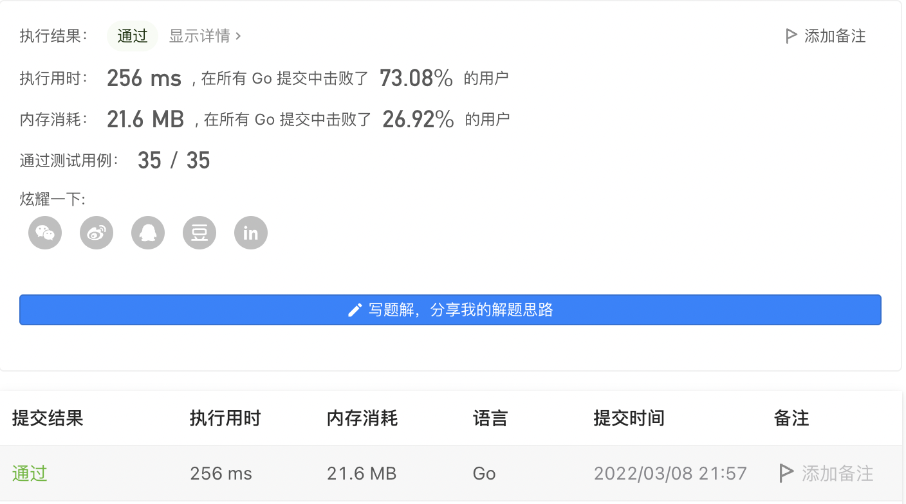

#### 2055. 蜡烛之间的盘子

#### 2022-03-08 LeetCode每日一题

链接：https://leetcode-cn.com/problems/plates-between-candles/

标签：**数组、前缀和、双指针**

> 

给你一个长桌子，桌子上盘子和蜡烛排成一列。给你一个下标从 0 开始的字符串 s ，它只包含字符 '*' 和 '|' ，其中 '*' 表示一个 盘子 ，'|' 表示一支 蜡烛 。

同时给你一个下标从 0 开始的二维整数数组 queries ，其中 queries[i] = [lefti, righti] 表示 子字符串 s[lefti...righti] （包含左右端点的字符）。对于每个查询，你需要找到 子字符串中 在 两支蜡烛之间 的盘子的 数目 。如果一个盘子在 子字符串中 左边和右边 都 至少有一支蜡烛，那么这个盘子满足在 两支蜡烛之间 。

- 比方说，s = "||**||**|*" ，查询 [3, 8] ，表示的是子字符串 "*||**|" 。子字符串中在两支蜡烛之间的盘子数目为 2 ，子字符串中右边两个盘子在它们左边和右边 都 至少有一支蜡烛。

请你返回一个整数数组 answer ，其中 answer[i] 是第 i 个查询的答案。 

示例 1:



```java
输入：s = "**|**|***|", queries = [[2,5],[5,9]]
输出：[2,3]
解释：

- queries[0] 有两个盘子在蜡烛之间。
- queries[1] 有三个盘子在蜡烛之间。
```

示例 2:


```java
输入：s = "***|**|*****|**||**|*", queries = [[1,17],[4,5],[14,17],[5,11],[15,16]]
输出：[9,0,0,0,0]
解释：

- queries[0] 有 9 个盘子在蜡烛之间。
- 另一个查询没有盘子在蜡烛之间。
```


提示：

- 3 <= s.length <= 10 ^ 5
- s 只包含字符 '*' 和 '|' 。
- 1 <= queries.length <= 10 ^ 5
- queries[i].length == 2
- 0 <= lefti <= righti < s.length

> 分析

因为字符串的长度和queries的长度均为10 ^ 5，如果每次都去遍历queries那么肯定会超时的。

这里我们首先可以想到的是对于子字符串 s[lefti...righti] ，只需要找到子字符串最外层的两个蜡烛（如果存在的话），那么在这两个蜡烛之间的所有盘子均符合条件。

我们可以使用前缀和sum记录每个下标其左侧盘子总数量。定义**sum[i]表示下标为i时，前面有几个盘子**。这样我们在求出子字符串最外层两个蜡烛的下标index1和index2后，`sum[index2] - sum[index1]`就表示两个蜡烛之间盘子的数量。

那么如果求子字符串最外层的两个蜡烛呢？这里尝试使用**双指针**，发现会超时。那么我们是否可以预先计算出每个下标其对应的左右两边最近的蜡烛下标呢？定义**left[i]表示每个坐标左侧最近的蜡烛下标**，**right[i]表示每个坐标右侧最近的蜡烛下标**。那么我们在求子字符串s[i...j]，其最外层的两个蜡烛坐标就是`right[left]`和`left[j]`。注意**左侧的i需要求其右侧最近的蜡烛，右侧j需要求其左侧最近的蜡烛**。

所以对于任意的子字符串s[i...j]，之间符合盘子的数量为`sum[left[j]] - sum[right[left]]`，前提是`left[j] > right[left] `。

> 编码

```java
class Solution {
    public int[] platesBetweenCandles(String s, int[][] queries) {
        int[] ans = new int[queries.length];
        // 记录下标为i时，前面有几个盘子
        int[] sum = new int[s.length()];
        // 记录每个坐标左侧最近的蜡烛下标
        int[] left = new int[s.length()];
        // 记录每个坐标右侧最近的蜡烛下标
        int[] right = new int[s.length()];
        char[] chs = s.toCharArray();
        // 注意lIndex和rIndex的初始化值
        int num = 0, lIndex = -1, rIndex = s.length();
        
        for (int i = 0; i < s.length(); i++) {
            if (chs[i] == '*') {
                num++;
            }
            sum[i] = num;

            if (chs[i] == '|') {
                lIndex = i;
            }
            left[i] = lIndex;
        }

        for (int i = s.length() - 1; i >= 0; i--) {
            if (chs[i] == '|') {
                rIndex = i;
            }
            right[i] = rIndex;
        }

        for (int m = 0; m < queries.length; m++) {
            // queries[m][0]右侧最近的蜡烛坐标，queries[m][1]左侧最近的蜡烛坐标
            int index1 = right[queries[m][0]], index2 = left[queries[m][1]];
            if (index1 < index2) {
                ans[m] = sum[index2] - sum[index1];
            }
        }

        return ans;
    }
}
```



```go
func platesBetweenCandles(s string, queries [][]int) []int {
    ans := make([]int, len(queries))
    sum := make([]int, len(s))
    left := make([]int, len(s))
    right := make([]int, len(s))
    count := 0
    lIndex := -1
    rIndex := len(s)

    for i := 0; i < len(s); i++ {
        if s[i] == '*' {
            count++;
        }
        sum[i] = count

        if s[i] == '|' {
            lIndex = i
        }
        left[i] = lIndex
    }

    for i := len(s) - 1; i >= 0; i-- {
        if s[i] == '|' {
            rIndex = i
        }
        right[i] = rIndex
    }

    for i := 0; i < len(queries); i++ {
        index1 := right[queries[i][0]]
        index2 := left[queries[i][1]]
        if index1 < index2 {
            ans[i] = sum[index2] - sum[index1]
        }
    }

    return ans
}
```

