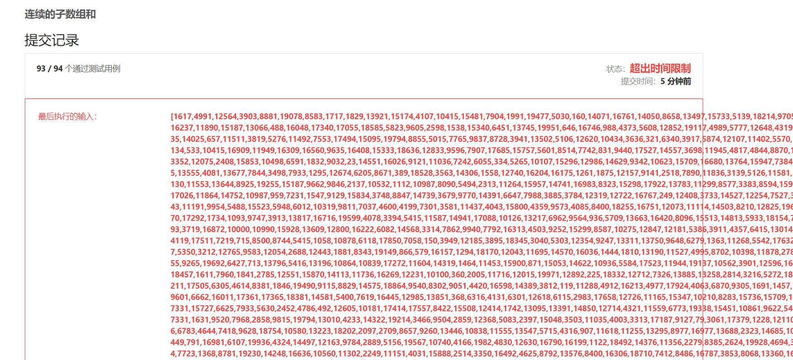
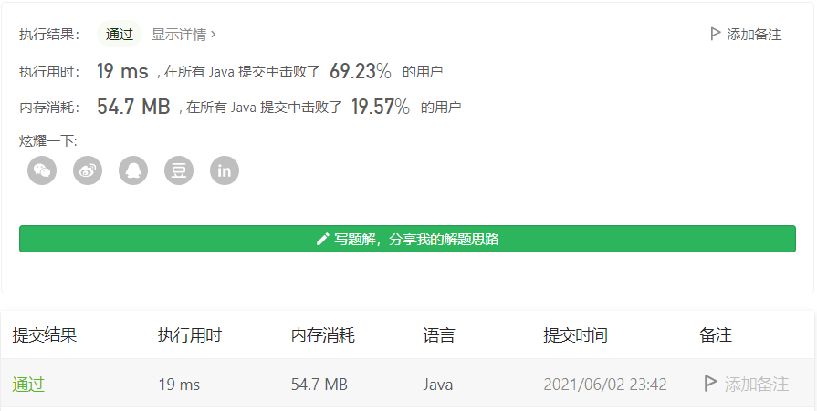

#### 523. 连续的子数组和

#### 2021-06-02 LeetCode每日一题

链接：https://leetcode-cn.com/problems/continuous-subarray-sum/

标签：数学、前缀和。

> 题目

给你一个整数数组 nums 和一个整数 k ，编写一个函数来判断该数组是否含有同时满足下述条件的连续子数组：

- 子数组大小 至少为 2 ，且
- 子数组元素总和为 k 的倍数。
- 如果存在，返回 true ；否则，返回 false 。

如果存在一个整数 n ，令整数 x 符合 x = n * k ，则称 x 是 k 的一个倍数。

```java
输入：nums = [23,2,4,6,7], k = 6
输出：true
解释：[2,4] 是一个大小为 2 的子数组，并且和为 6 。
    
输入：nums = [23,2,6,4,7], k = 6
输出：true
解释：[23, 2, 6, 4, 7] 是大小为 5 的子数组，并且和为 42 。 
42 是 6 的倍数，因为 42 = 7 * 6 且 7 是一个整数。

输入：nums = [23,2,6,4,7], k = 13
输出：false
    
1 <= nums.length <= 10^5
0 <= nums[i] <= 10^9
0 <= sum(nums[i]) <= 2^31 - 1
1 <= k <= 2^31 - 1
```

> 分析

数组长度最长为10^5，所以暴力法应该是会超时的，不幸在倒数第二个用例超时了。

这里如果要ac的话，应该是要是要O(n)复杂度的，不然肯定过不了。可以从中找规律，假设sum[i]表示前i个元素的和，那么sum[i] % k == sum[j] % k，则(sum[j] - sum[i]) % k == 0，这里假设j > i。发现了这个规律就好办了，前缀和求出前n个元素的总和，然后求余的值作为map的键存入map，每次只需要判断键是否存在，如果存在，再判断子数组的大小至少为2，如果这两个条件都符合，则返回true了。

> 编码

**前缀和 + 暴力法**

```java
class Solution {
    public boolean checkSubarraySum(int[] nums, int k) {
       int len = nums.length;
       int[] sum = new int[len + 1];
       sum[1] = nums[0];

       for (int i = 2; i <= len; i++) {
           sum[i] = sum[i - 1] + nums[i - 1];
           if (sum[i] % k == 0) {
               return true;
           }
       }
       for (int i = 2; i <= len; i++) {
           for (int j = i - 1; j > 0; j--) {
               if ((sum[i] - sum[j - 1]) % k == 0) {
                   return true;
               } 
           }
       } 

       return false;
    }
}
```



**前缀和 + map**

```java
class Solution {
    public boolean checkSubarraySum(int[] nums, int k) {
       int len = nums.length;
       int sum = 0;
       Map<Integer, Integer> map = new HashMap<>();
       // 及其巧妙的一步
       map.put(0, -1);

       for (int i = 0; i < len; i++) {
           sum += nums[i];
           int value = sum % k;
           if (map.containsKey(value)) {
               // 大小至少为3
               if (i - map.get(value) > 1) {
                   return true;
               }
           } else {
               map.put(value, i);
           }
       }
       
       return false;
    }
}
```

在提交的时候发现，如果是子数组大小至少为2，则过不了倒数第二个用例

```java
if (i - map.get(value) >= 1)
```

改成如下，就可以通过，这说明子数组大小至少为3才行。

```java
if (i - map.get(value) > 1)
```

但构造下面的测试用例，发现预期结果又是true，这说明子数组的大小可以为2。

```java
[0, 0]
6
```

最终还是按照子数组至少为3的条件提交通过。



