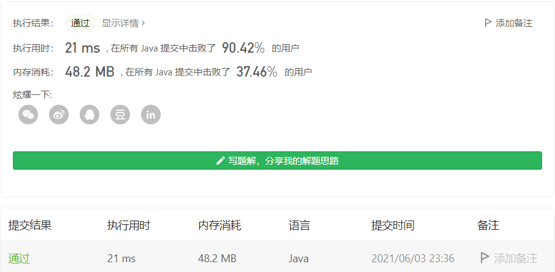

#### 525. 连续数组

#### 2021-06-03 LeetCode每日一题

链接：https://leetcode-cn.com/problems/contiguous-array/

标签：**前缀和、哈希表**

> 题目

给定一个二进制数组 `nums` , 找到含有相同数量的 `0` 和 `1` 的最长连续子数组，并返回该子数组的长度。

```java
输入: nums = [0,1]
输出: 2
说明: [0, 1] 是具有相同数量0和1的最长连续子数组。
    
输入: nums = [0,1,0]
输出: 2
说明: [0, 1] (或 [1, 0]) 是具有相同数量0和1的最长连续子数组。
    
1 <= nums.length <= 105
nums[i] 不是 0 就是 1
```

> 解析

此题关键在于把数组里等于0的元素替换为等于1的元素，然后利用前缀和，每次遍历时，把前n个数的和作为键，下标n作为值加入map，如果该键已经存在，那么说明当前下标和下标n之间的数，总和为0，即有相同的数量的-1和1。

> 编码

```java
class Solution {
    public int findMaxLength(int[] nums) {
        Map<Integer, Integer> map = new HashMap<>();
        int sum = 0, max = 0;

        for (int i = 0; i < nums.length; i++) {
            if (nums[i] == 0) {
                nums[i] = -1;
            }
        }

        for (int i = 0; i < nums.length; i++) {
            sum += nums[i];
            if (sum == 0 && i > max) {
                max = i + 1;
            }

            if (map.containsKey(sum)) {
                max = Math.max(max, i - map.get(sum));
            } else {
                map.put(sum, i);
            }
        }

        return max;
    }
}
```

