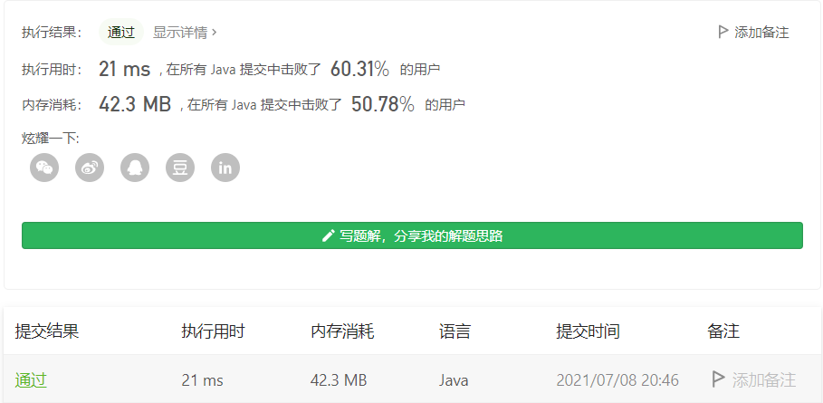

#### 930. 和相同的二元子数组

#### 2021-07-08 LeetCode每日一题

链接：https://leetcode-cn.com/problems/binary-subarrays-with-sum/

标签：**前缀和、哈希表**

> 题目

给你一个二元数组 `nums` ，和一个整数 `goal` ，请你统计并返回有多少个和为 `goal` 的 **非空** 子数组。

**子数组** 是数组的一段连续部分。

示例 1：

```java
输入：nums = [1,0,1,0,1], goal = 2
输出：4
解释：
有 4 个满足题目要求的子数组：[1,0,1]、[1,0,1,0]、[0,1,0,1]、[1,0,1]
```

示例 2：

```java
输入：nums = [0,0,0,0,0], goal = 0
输出：15
```


提示：

- 1 <= nums.length <= 3 * 104
- nums[i] 不是 0 就是 1
- 0 <= goal <= nums.length

> 分析

一个简单的想法是，先计算 nums 的前缀和数组 sum，然后从前往后扫描 nums，对于右端点 r，通过前缀和数组可以在 O(1) 复杂度内求得 [0, r]连续一段的和，根据容斥原理，我们还需要求得某个左端点 l，使得 [0, r] 减去 [0, l - 1] 和为 t，即满足 sum[r] - sum[l - 1] = t，这时候利用哈希表记录扫描过的 sum[i] 的出现次数，可以实现 O(1) 复杂度内求得满足要求的**左端点个数**。

该方法适用于 nums[i]值不固定为0 和 1 的其他情况。

题解来自：https://leetcode-cn.com/problems/binary-subarrays-with-sum/solution/gong-shui-san-xie-yi-ti-shuang-jie-qian-hfoc0/

> 编码

```java
class Solution {
    public int numSubarraysWithSum(int[] nums, int goal) {
        int res = 0;
        int sum = 0;
        Map<Integer, Integer> map = new HashMap<>();
        map.put(0, 1);

        for (int i = 0; i < nums.length; i++) {
            sum += nums[i];
            if (map.containsKey(sum - goal)) {
                res += map.get(sum - goal);
            }
            map.put(sum, map.getOrDefault(sum, 0) + 1);
        }

        return res;
    }
}
```

