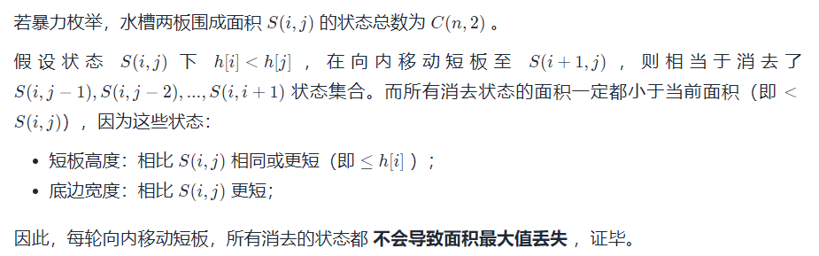
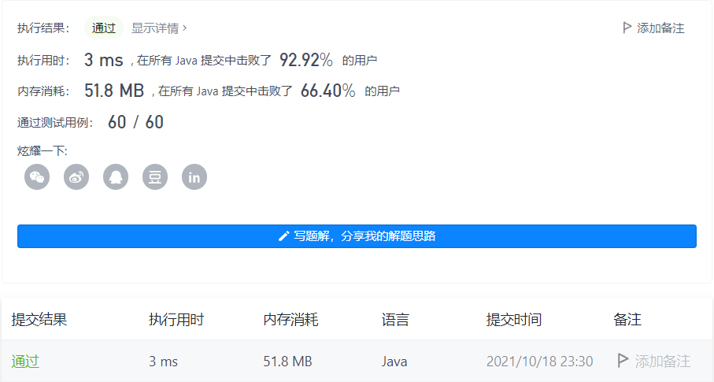

#### 11. 盛最多水的容器

链接：https://leetcode-cn.com/problems/container-with-most-water/

标签：**双指针、数组、贪心**

> 题目

给你 n 个非负整数 a1，a2，...，an，每个数代表坐标中的一个点 (i, ai) 。在坐标内画 n 条垂直线，垂直线 i 的两个端点分别为 (i, ai) 和 (i, 0) 。找出其中的两条线，使得它们与 x 轴共同构成的容器可以容纳最多的水。

说明：你不能倾斜容器。

示例 1：


```java
输入：[1,8,6,2,5,4,8,3,7]
输出：49 
解释：图中垂直线代表输入数组 [1,8,6,2,5,4,8,3,7]。在此情况下，容器能够容纳水（表示为蓝色部分）的最大值为 49。
```

示例 2：

```java
输入：height = [1,1]
输出：1
```

示例 3：

```java
输入：height = [4,3,2,1,4]
输出：16
```

示例 4：

```java
输入：height = [1,2,1]
输出：2
```


提示：

- n == height.length
- 2 <= n <= 10 ^ 5
- 0 <= height[i] <= 10 ^ 4

> 分析

用双指针 + 贪心做。

为何用双指针：



为何用贪心：对于两块板子(i, hi)，(j, hj)，i < j && hi > hj。那么此时容量为(j - i) * hj，取高矮的那个高度。接下来我们需要把更矮的那块板子向左移动。为何是移动更矮的而不是更高的那块？因为宽度在缩小，而对于高度来说，只能取更矮的那个，如果移动更高的那块，那么不论下一块板子高度如何，能取的最大高度 <= hj。容量总是要 < (j - i) * hj。

> 编码

```java
class Solution {
    public int maxArea(int[] height) {
        int left = 0, right = height.length - 1;
        int ans = 0;
        while (left < right) {
            int x = right - left;
            int y = 0;
            if (height[left] < height[right]) {
                // 高取更矮的那个，left向右移动
                // 如果right向左移动，因为left更矮，不管right - 1对应的容器有多高
                // 根据最短木桶原理，都只能取left对应容器的高，而宽度变短，所以始终要小于right左移前的容量
                y = height[left++];
            } else {
                y = height[right--];
            }

            if (ans < x * y) {
                ans = x * y;
            }
        }

        return ans;
    }
}
```

