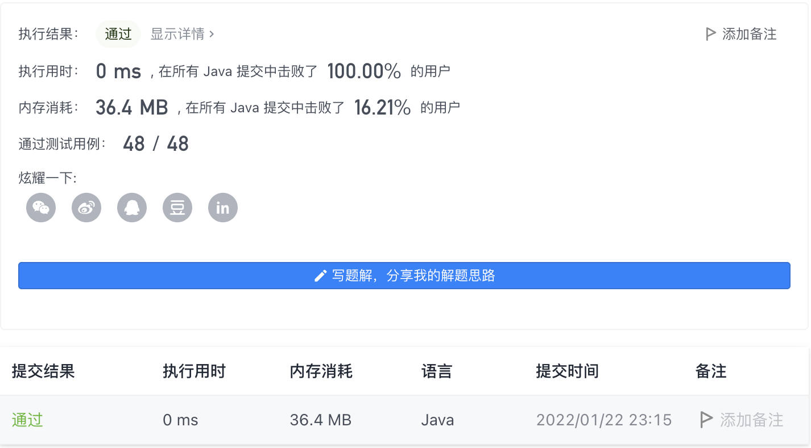

#### 1332. 删除回文子序列

#### 2022-01-22 LeetCode每日一题

链接：https://leetcode-cn.com/problems/remove-palindromic-subsequences/

标签：**字符串、双指针**

> 题目

给你一个字符串 s，它仅由字母 'a' 和 'b' 组成。每一次删除操作都可以从 s 中删除一个回文 子序列。

返回删除给定字符串中所有字符（字符串为空）的最小删除次数。

「子序列」定义：如果一个字符串可以通过删除原字符串某些字符而不改变原字符顺序得到，那么这个字符串就是原字符串的一个子序列。

「回文」定义：如果一个字符串向后和向前读是一致的，那么这个字符串就是一个回文。

示例 1：

```java
输入：s = "ababa"
输出：1
解释：字符串本身就是回文序列，只需要删除一次。
```

示例 2：

```java
输入：s = "abb"
输出：2
解释："abb" -> "bb" -> "". 
先删除回文子序列 "a"，然后再删除 "bb"。
```

示例 3：

```java
输入：s = "baabb"
输出：2
解释："baabb" -> "b" -> "". 
先删除回文子序列 "baab"，然后再删除 "b"。
```


提示：

- 1 <= s.length <= 1000
- s 仅包含字母 'a'  和 'b'

> 分析

因为s只包含a、b两种字符，所以最多只需要两次就能删除所有字符。

- 如果s是回文子串，那么只需要删除一次。
- 如果s不是回文子串，那么第一次删除所有的a，第二次删除所有的b即可。

> 编码

```java
class Solution {
    public int removePalindromeSub(String s) {
        int left = 0, right = s.length() - 1;
        while (left < right) {
            if (s.charAt(left) == s.charAt(right)) {
                left++;
                right--;
            } else {
                break;
            }
        }

        // 如果s是回文串，那么只需要删除一次，如果s不是回文串，那么只需要删除一次，第一次全部删除a，第二次全部删除b
        return left < right ? 2 : 1;
    }
}
```

