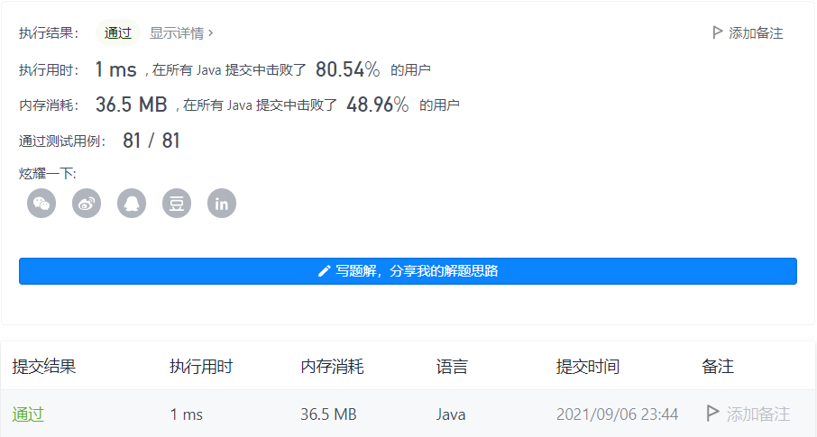
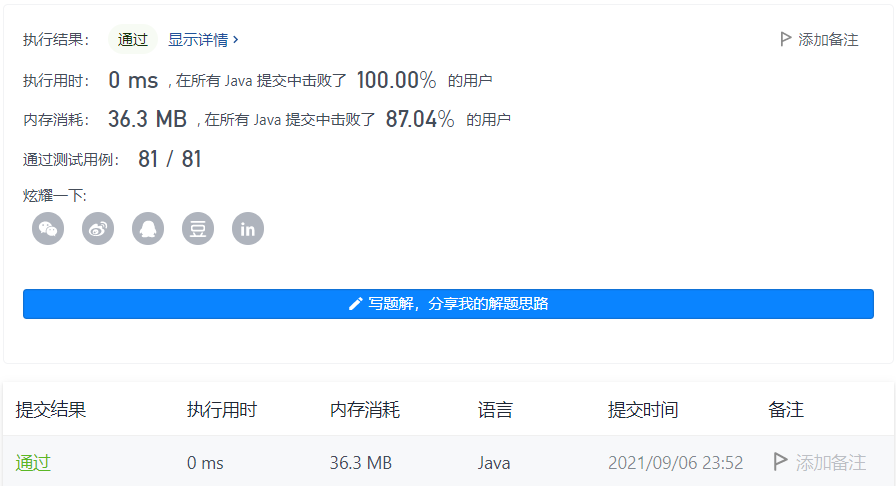

#### 165. 比较版本号

#### 2021-09-01 LeetCode每日一题

链接：https://leetcode-cn.com/problems/compare-version-numbers/

标签：**字符串、双指针**

> 题目

给你两个版本号 version1 和 version2 ，请你比较它们。

版本号由一个或多个修订号组成，各修订号由一个 '.' 连接。每个修订号由 多位数字 组成，可能包含 前导零 。每个版本号至少包含一个字符。修订号从左到右编号，下标从 0 开始，最左边的修订号下标为 0 ，下一个修订号下标为 1 ，以此类推。例如，2.5.33 和 0.1 都是有效的版本号。

比较版本号时，请按从左到右的顺序依次比较它们的修订号。比较修订号时，只需比较 忽略任何前导零后的整数值 。也就是说，修订号 1 和修订号 001 相等 。如果版本号没有指定某个下标处的修订号，则该修订号视为 0 。例如，版本 1.0 小于版本 1.1 ，因为它们下标为 0 的修订号相同，而下标为 1 的修订号分别为 0 和 1 ，0 < 1 。

返回规则如下：

- 如果 version1 > version2 返回 1，
- 如果 version1 < version2 返回 -1，
- 除此之外返回 0。


示例 1：

```java
输入：version1 = "1.01", version2 = "1.001"
输出：0
解释：忽略前导零，"01" 和 "001" 都表示相同的整数 "1"
```

示例 2：

```java
输入：version1 = "1.0", version2 = "1.0.0"
输出：0
解释：version1 没有指定下标为 2 的修订号，即视为 "0"
```

示例 3：

```java
输入：version1 = "0.1", version2 = "1.1"
输出：-1
解释：version1 中下标为 0 的修订号是 "0"，version2 中下标为 0 的修订号是 "1" 。0 < 1，所以 version1 < version2
```

示例 4：

```java
输入：version1 = "1.0.1", version2 = "1"
输出：1
```

示例 5：

```java
输入：version1 = "7.5.2.4", version2 = "7.5.3"
输出：-1
```


提示：

- 1 <= version1.length, version2.length <= 500
- version1 和 version2 仅包含数字和 '.'
- version1 和 version2 都是 有效版本号
- version1 和 version2 的所有修订号都可以存储在 32 位整数 中

> 分析

解法1：可以先把字符串按`.`进行分割成字符串数组，然后数组的元素一一进行对比即可。

解法2：用双指针，分别从两个字符串开始，遇到`.`就比较一次。

> 编码

**解法1**：

```java
class Solution {
    public int compareVersion(String version1, String version2) {
        String[] c1 = version1.split("\\.");
        String[] c2 = version2.split("\\.");
        int count = 0, len = Math.max(c1.length, c2.length);

        for (int i = 0; i < len; i++) {
            int a = (i < c1.length ? Integer.valueOf(c1[i]) : 0);
            int b = (i < c2.length ? Integer.valueOf(c2[i]) : 0);
            if (a < b) {
                return -1;
            } else if (a > b) {
                return 1;
            }
        }
        return 0;
    }
}
```



**解法2**：

```java
class Solution {
    public int compareVersion(String version1, String version2) {
        int a = 0, b = 0;
        while (a < version1.length() || b < version2.length()) {
            int num1 = 0, num2 = 0;
            while (a < version1.length() && version1.charAt(a) != '.') {
                num1 = num1 * 10 + version1.charAt(a) - '0';
                a++;
            }
            while (b < version2.length() && version2.charAt(b) != '.') {
                num2 = num2 * 10 + version2.charAt(b) - '0';
                b++;
            }
            if (num1 < num2) {
                return -1;
            } else if (num1 > num2) {
                return 1;
            } else {
                a++;
                b++;
            }
        }

        return 0;
    }
}
```

