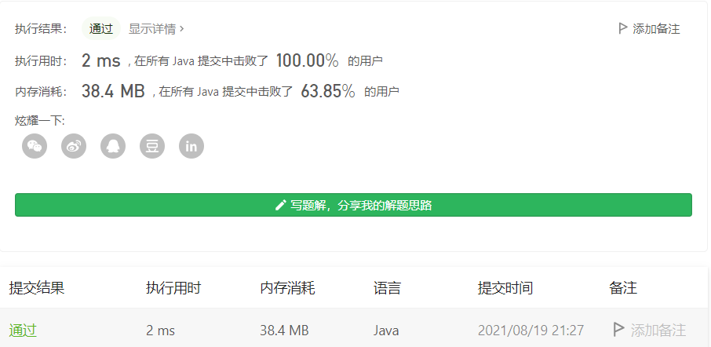

#### 345. 反转字符串中的元音字母

#### 2021-08-19 LeetCode每日一题

链接：https://leetcode-cn.com/problems/reverse-vowels-of-a-string/

标签：字符串、双指针

> 题目

给你一个字符串 s ，仅反转字符串中的所有元音字母，并返回结果字符串。

元音字母包括 'a'、'e'、'i'、'o'、'u'，且可能以大小写两种形式出现。

示例 1：

```java
输入：s = "hello"
输出："holle"
```

示例 2：

```java
输入：s = "leetcode"
输出："leotcede"
```


提示：

- 1 <= s.length <= 3 * 10 ^ 5
- s 由 可打印的 ASCII 字符组成

> 分析

简单题我重拳出击，困难题我唯唯诺诺。

这题一看就是用双指针做。左右两个指针分别往中间移动，一旦找到了两个元音字母，就交换位置。如果只找到了一个，那么只移动另一个指针，直到找到两个。

> 编码

```java
class Solution {
    public String reverseVowels(String s) {
        int left = 0, right = s.length() - 1;
        char[] chs = s.toCharArray();
        
        while (left < right) {
            if (isVowel(chs[left]) && isVowel(chs[right])) {
                char temp = chs[left];
                chs[left] = chs[right];
                chs[right] = temp;
                left++;
                right--;
            } else if (isVowel(chs[left])) {
                right--;
            } else if (isVowel(chs[right])) {
                left++;
            } else {
                right--;
                left++;
            }
        }

        return new String(chs);
    }

    private boolean isVowel(char c) {
        if (c == 'a' || c == 'e' || c == 'i' || c == 'o' || c == 'u' || 
            c == 'A' || c == 'E' || c == 'I' || c == 'O' || c == 'U') {
            return true;
        }
        return false;
    }
}
```

