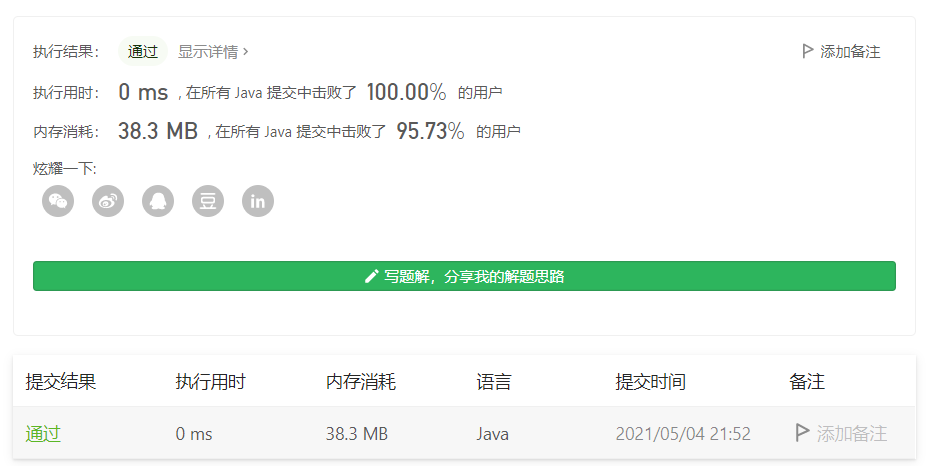

#### 80. 删除有序数组中的重复项 II

链接：https://leetcode-cn.com/problems/remove-duplicates-from-sorted-array-ii/

这题题目给的标签是双指针，但没有使用双指针解题。

```java
class Solution {
    public int removeDuplicates(int[] nums) {
        int count = 0;
        for (int num : nums) {
            if (count < 2 || nums[count - 2] != num) {
                nums[count++] = num;
            }
        }

        return count;
    }
}
```

