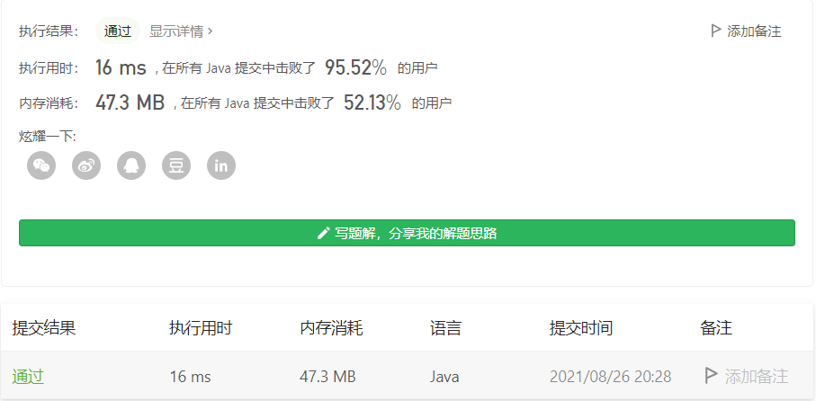

#### 881. 救生艇

#### 2021-08-26 LeetCode每日一题

链接：https://leetcode-cn.com/problems/boats-to-save-people/

标签：**贪心、排序、数组、双指针**

> 题目

第 i 个人的体重为 people[i]，每艘船可以承载的最大重量为 limit。

每艘船最多可同时载两人，但条件是这些人的重量之和最多为 limit。

返回载到每一个人所需的最小船数。(保证每个人都能被船载)。

示例 1：

```java
输入：people = [1,2], limit = 3
输出：1
解释：1 艘船载 (1, 2)
```

示例 2：

```java
输入：people = [3,2,2,1], limit = 3
输出：3
解释：3 艘船分别载 (1, 2), (2) 和 (3)
```

示例 3：

```java
输入：people = [3,5,3,4], limit = 5
输出：4
解释：4 艘船分别载 (3), (3), (4), (5)
```

提示：

- 1 <= people.length <= 50000
- 1 <= people[i] <= limit <= 30000

> 分析

题目规定每艘船最多载2人，并且所有人都要坐上船，求最少要几条船。

这种**最少**的问题，只要每次保证选择是最优解。这里就是每次尽量选择两个人坐船，这样最后就是最少数量。可以使用**排序 + 双指针**。

重量从小到大排完后，两边一起移动，如果两个体重和不大于limit，则说明两个人可以坐一条船，如果大于limit，则说明右边这个人只能坐一条船，因为左边的这个人是目前未上船的人中体重最小的，再也找不到比它更小的人了。

> 编码

```java
class Solution {
    public int numRescueBoats(int[] people, int limit) {
        int res = 0, len = people.length;
        Arrays.sort(people);
        int left = 0, right = len - 1;

        while (left <= right) {
            // 一艘船可以载两个人
            if (people[left] + people[right] <= limit) {
                res++;
                left++;
                right--;
            } else {
                // 和体重最小的都坐不下，则下标为right的单独坐一艘船
                res++;
                right--;
            }
        } 

        return res;
    }
}
```

