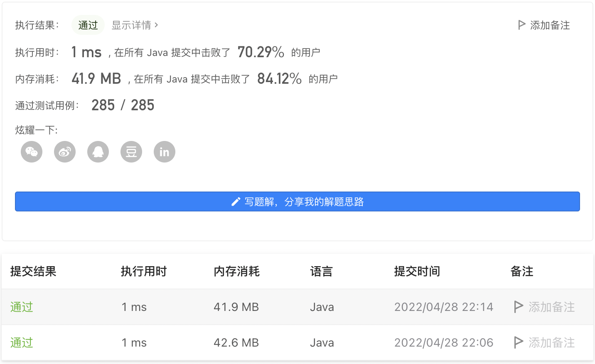

#### 905. 按奇偶排序数组

#### 2022-04-28 LeetCode每日一题

链接：https://leetcode-cn.com/problems/sort-array-by-parity/

标签：**数组、双指针**

> 题目

给你一个整数数组 nums，将 nums 中的的所有偶数元素移动到数组的前面，后跟所有奇数元素。

返回满足此条件的 任一数组 作为答案。 

示例 1：

```java
输入：nums = [3,1,2,4]
输出：[2,4,3,1]
解释：[4,2,3,1]、[2,4,1,3] 和 [4,2,1,3] 也会被视作正确答案。
```

示例 2：

```java
输入：nums = [0]
输出：[0]
```


提示：

- 1 <= nums.length <= 5000
- 0 <= nums[i] <= 5000

> 分析

可以使用一个新数组。

或者双指针。

> 编码

```java
class Solution {
    public int[] sortArrayByParity(int[] nums) {
        int left = 0, right = nums.length - 1;
        while (left < right) {
            if (nums[left] % 2 != 0 && nums[right] % 2 == 0) {
                int temp = nums[left];
                nums[left] = nums[right];
                nums[right] = temp;
                left++;
                right--;
            } else if (nums[left] % 2 != 0 && nums[right] % 2 != 0) {
                right--;
            } else if (nums[left] % 2 == 0 && nums[right] % 2 != 0) {
                left++;
                right--;
            } else if (nums[left] % 2 == 0 && nums[right] % 2 == 0) {
                left++;
            }
        }

        return nums;
    }
}
```



```java
class Solution {
    public int[] sortArrayByParity(int[] nums) {
        int[] res = new int[nums.length];
        int left = 0, right = nums.length - 1;

        for (int i = 0; i < res.length; i++) {
            if (nums[i] % 2 == 0) {
                res[left++] = nums[i];
            } else {
                res[right--] = nums[i];
            }
        }

        return res;
    }
}
```

