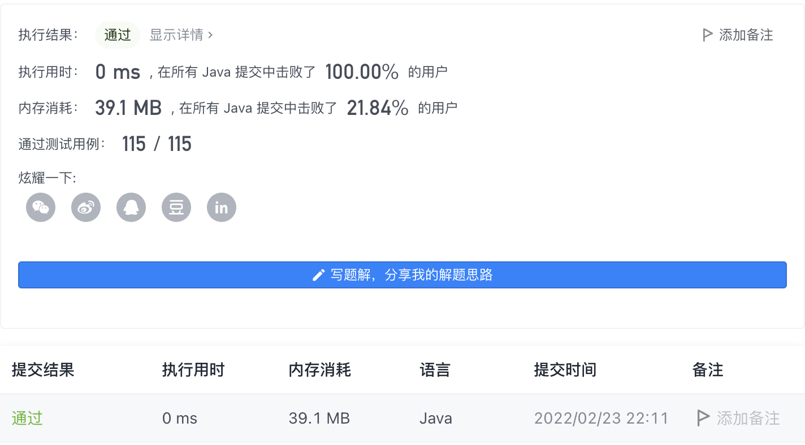

#### 917. 仅仅反转字母

#### 2022-02-23 LeetCode每日一题

链接：https://leetcode-cn.com/problems/reverse-only-letters/

标签：**字符串、双指针**

> 题目

给你一个字符串 s ，根据下述规则反转字符串：

- 所有非英文字母保留在原有位置。
- 所有英文字母（小写或大写）位置反转。

返回反转后的 s 。 

示例 1：

```java
输入：s = "ab-cd"
输出："dc-ba"
```

示例 2：

```java
输入：s = "a-bC-dEf-ghIj"
输出："j-Ih-gfE-dCba"
```

示例 3：

```java
输入：s = "Test1ng-Leet=code-Q!"
输出："Qedo1ct-eeLg=ntse-T!"
```


提示

- 1 <= s.length <= 100
- s 仅由 ASCII 值在范围 [33, 122] 的字符组成
- s 不含 '\"' 或 '\\'

> 分析

两个指针分别执行字符串的开头和结尾，每次移动一步同时往字符串中间移动，如果任何一个指针遇到非字符则移动到下一个字符。如果两个指针同时指向字符则交换这两个位置的字符。

> 编码

```java
class Solution {
    public String reverseOnlyLetters(String s) {
        int left = 0, right = s.length() - 1;
        char[] chs = s.toCharArray();
        
        while (left < right) {
            if (!Character.isLetter(chs[left])) {
                left++;
                continue;
            }
            if (!Character.isLetter(chs[right])) {
                right--;
                continue;
            }

            char temp = chs[left];
            chs[left] = chs[right];
            chs[right] = temp;
            left++;
            right--;
        }

        return new String(chs);
    }
}
```

