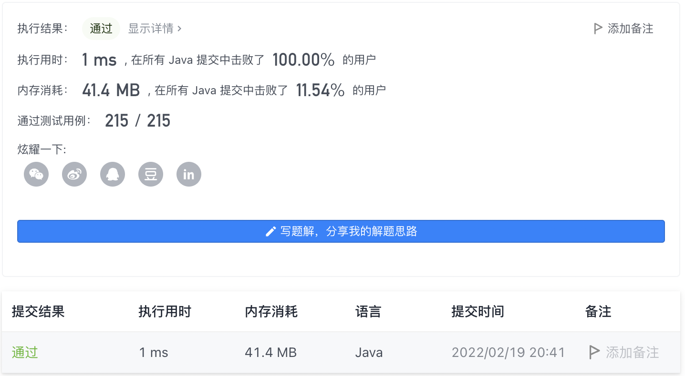

#### 969. 煎饼排序

#### 2022-02-19 LeetCode每日一题

链接：https://leetcode-cn.com/problems/pancake-sorting/

标签：**贪心、数组、 双指针、排序**

> 题目

给你一个整数数组 arr ，请使用 煎饼翻转 完成对数组的排序。

一次煎饼翻转的执行过程如下：

- 选择一个整数 k ，1 <= k <= arr.length
- 反转子数组 arr[0...k-1]（下标从 0 开始）

例如，arr = [3,2,1,4] ，选择 k = 3 进行一次煎饼翻转，反转子数组 [3,2,1] ，得到 arr = [1,2,3,4] 。

以数组形式返回能使 arr 有序的煎饼翻转操作所对应的 k 值序列。任何将数组排序且翻转次数在 10 * arr.length 范围内的有效答案都将被判断为正确。

示例 1：

```java
输入：[3,2,4,1]
输出：[4,2,4,3]
解释：
我们执行 4 次煎饼翻转，k 值分别为 4，2，4，和 3。
初始状态 arr = [3, 2, 4, 1]
第一次翻转后（k = 4）：arr = [1, 4, 2, 3]
第二次翻转后（k = 2）：arr = [4, 1, 2, 3]
第三次翻转后（k = 4）：arr = [3, 2, 1, 4]
第四次翻转后（k = 3）：arr = [1, 2, 3, 4]，此时已完成排序。 
```

示例 2：

```java
输入：[1,2,3]
输出：[]
解释：
输入已经排序，因此不需要翻转任何内容。
请注意，其他可能的答案，如 [3，3] ，也将被判断为正确。
```


提示：

- 1 <= arr.length <= 100
- 1 <= arr[i] <= arr.length
- arr 中的所有整数互不相同（即，arr 是从 1 到 arr.length 整数的一个排列）

> 分析

因为数组中每个数都不相同，所以我们可以每次把最大的数找出来，然后放到数组末尾，其实就相当于**冒泡排序**。假设最大数的下标为index，已排序的元素个数为count，数组长度为len，则index有以下几种情况

- 如果index = len - count - 1，则说明已经位于未排序数组的末尾，不用翻转，count自增，继续下一趟循环。
- 如果index = 0，则说明最大数位于未排序数组的第一个，则直接翻转[0, len - count - 1]之间的数，这样最大数就会位于未排序数组的末尾。
- 如果0 < index < len - count - 1，则需要先翻转[0, index]，让最大数处于未排序数组第一个，然后在翻转[0, len - count - 1]让最大数位于未排序数组末尾即可。

循环上面三步，直到所有元素都有序。对某个范围内的元素进行排序，可以使用**双指针**。

每个元素需要翻转的次数是[0, 1, 2]，所以整个数组有序需要翻转的次数最多为2 * arr.length次，不会超出10 * arr.length。

> 编码

```java
class Solution {
    public List<Integer> pancakeSort(int[] arr) {
        List<Integer> ans = new ArrayList<>();

        // 每次循环把最大值放到数组末尾，一个数最多需要两次翻转即可。
        for (int i = 0; i < arr.length; i++) {
            int index = 0;
            // 查找最大值
            for (int j = 0; j < arr.length - i; j++) {
                if (arr[j] > arr[index]) {
                    index = j;
                }
            }
            // 如果最大值的下标是arr.length - i - 1，则不用翻转
            if (index == arr.length - i - 1) {
                continue;
            } else if (index != 0) {
                // 翻转[0, index]
                ans.add(index + 1);
                int left = 0, right = index;
                while (left < right) {
                    int temp = arr[left];
                    arr[left] = arr[right];
                    arr[right] = temp;
                    left++;
                    right--;
                }
            }

            if (index != arr.length - i - 1) {
                // 翻转[0, arr.length - i - 1]
                ans.add(arr.length - i);
                int left = 0, right = arr.length - i - 1;
                while (left < right) {
                    int temp = arr[left];
                    arr[left] = arr[right];
                    arr[right] = temp;
                    left++;
                    right--;
                }
            }
        }

        return ans;
    }
}
```

