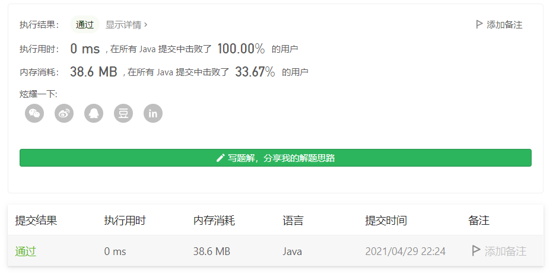

#### 面试题 10.01. 合并排序的数组

链接：https://leetcode-cn.com/problems/sorted-merge-lcci/

```java
class Solution {
    public void merge(int[] A, int m, int[] B, int n) {
        int len = m + n - 1, a = m - 1, b = n - 1;
        while (a >=0 && b >= 0) {
            if (A[a] > B[b]) {
                A[len--] = A[a--];
            } else {
                A[len--] = B[b--];
            }
        }

        while (b >= 0) {
            A[len--] = B[b--];
        }
    }
}
```

