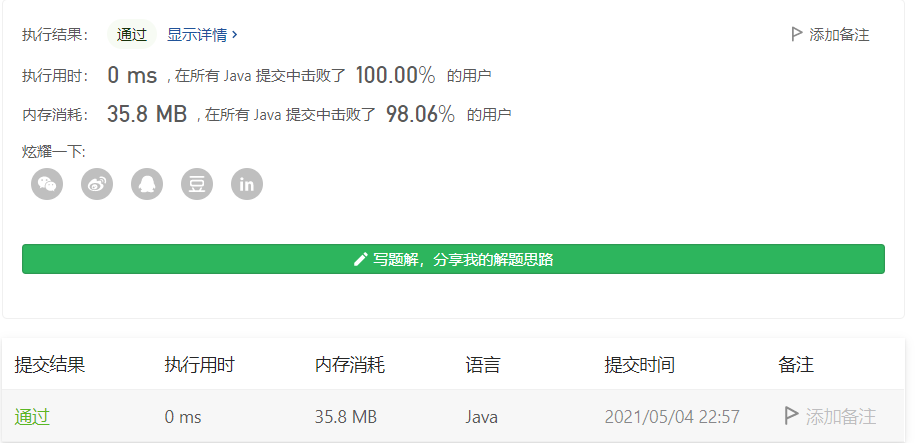

#### 面试题 02.02. 返回倒数第 k 个节点

链接：https://leetcode-cn.com/problems/kth-node-from-end-of-list-lcci/

```java
/**
 * Definition for singly-linked list.
 * public class ListNode {
 *     int val;
 *     ListNode next;
 *     ListNode(int x) { val = x; }
 * }
 */
class Solution {
    public int kthToLast(ListNode head, int k) {
        if (k == 0) {
            return head.val;
        }

        ListNode slow = head, fast = head;
        while (k-- > 0 && head != null) {
            fast = fast.next;
        }

        while (fast != null) {
            fast = fast.next;
            slow = slow.next;
        }

        return slow.val;
    }
}
```



