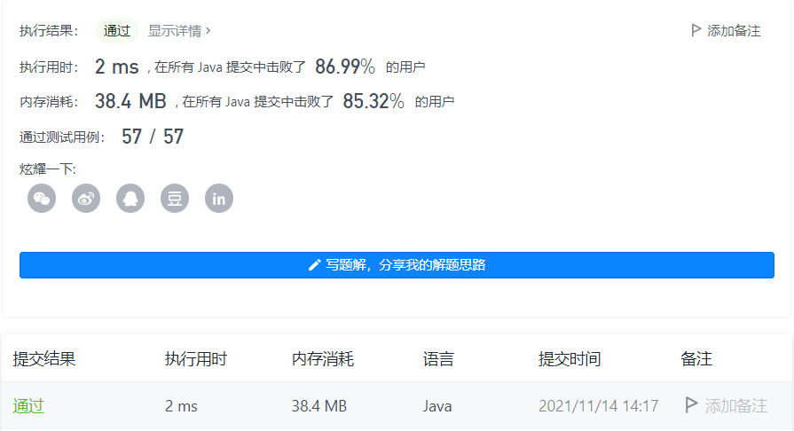
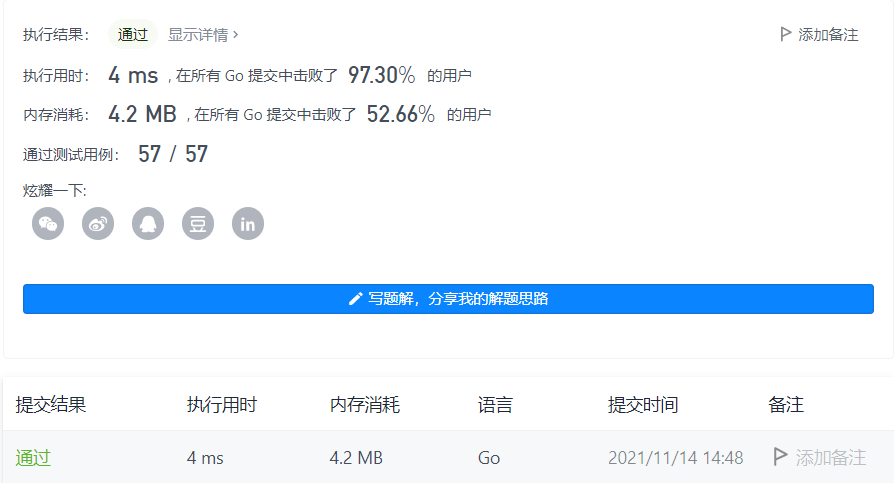

#### 1. 两数之和

链接：https://leetcode-cn.com/problems/two-sum/

标签：**数组、哈希表**

> 题目

给定一个整数数组 nums 和一个整数目标值 target，请你在该数组中找出 和为目标值 target  的那 两个 整数，并返回它们的数组下标。

你可以假设每种输入只会对应一个答案。但是，数组中同一个元素在答案里不能重复出现。

你可以按任意顺序返回答案。

示例 1：

```java
输入：nums = [2,7,11,15], target = 9
输出：[0,1]
解释：因为 nums[0] + nums[1] == 9 ，返回 [0, 1] 。
```

示例 2：

```java
输入：nums = [3,2,4], target = 6
输出：[1,2]
```

示例 3：

```java
输入：nums = [3,3], target = 6
输出：[0,1]
```


提示：

- 2 <= nums.length <= 10 ^ 4
- -10 ^ 9 <= nums[i] <= 10 ^ 9
- -10 ^ 9 <= target <= 10 ^ 9
- 只会存在一个有效答案

进阶：你可以想出一个时间复杂度小于 O(n2) 的算法吗？

> 分析

因为要返回数的下标，所以不能先排序再双指针，因为排序后下标就乱了。

这里使用哈希表记录，键不是nums[i]，而是target - nums[i]。这样只需要循环一次就能拿到两个数。

> 编码

Java版本

```java
class Solution {
    public int[] twoSum(int[] nums, int target) {
        int[] res = new int[2];
        Map<Integer, Integer> map = new HashMap<>();

        for (int i = 0; i < nums.length; i++) {
            if (!map.containsKey(nums[i])) {
                map.put(target - nums[i], i);
            } else {
                res[0] = map.get(nums[i]);
                res[1] = i;
                break;
            }
        }

        return res;
    }
}
```



Go版本

```java
func twoSum(nums []int, target int) []int {
    res := make([]int, 2)
    m := make(map[int]int)

    for i := 0; i < len(nums); i++ {
        if _, ok := m[nums[i]]; !ok {
            m[target - nums[i]] = i
        } else {
            res[0] = m[nums[i]]
            res[1] = i
            break
        }
    }

    return res
}
```

