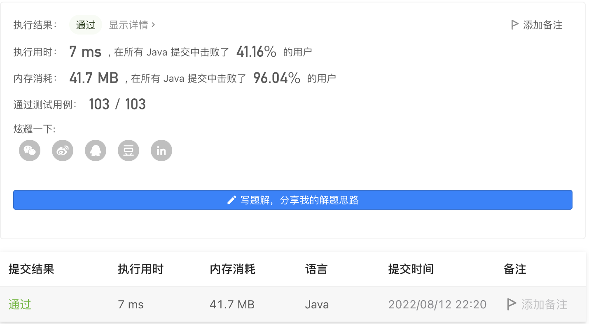

#### 1282. 用户分组

#### 2022-08-12 LeetCode每日一题

链接：https://leetcode.cn/problems/group-the-people-given-the-group-size-they-belong-to/

标签：**数组、哈希表**

> 题目

有 n 个人被分成数量未知的组。每个人都被标记为一个从 0 到 n - 1 的唯一ID 。

给定一个整数数组 groupSizes ，其中 groupSizes[i] 是第 i 个人所在的组的大小。例如，如果 groupSizes[1] = 3 ，则第 1 个人必须位于大小为 3 的组中。

返回一个组列表，使每个人 i 都在一个大小为 groupSizes[i] 的组中。

每个人应该 恰好只 出现在 一个组 中，并且每个人必须在一个组中。如果有多个答案，返回其中 任何 一个。可以 保证 给定输入 至少有一个 有效的解。

示例 1：

```java
输入：groupSizes = [3,3,3,3,3,1,3]
输出：[[5],[0,1,2],[3,4,6]]
解释：
第一组是 [5]，大小为 1，groupSizes[5] = 1。
第二组是 [0,1,2]，大小为 3，groupSizes[0] = groupSizes[1] = groupSizes[2] = 3。
第三组是 [3,4,6]，大小为 3，groupSizes[3] = groupSizes[4] = groupSizes[6] = 3。 
其他可能的解决方案有 [[2,1,6],[5],[0,4,3]] 和 [[5],[0,6,2],[4,3,1]]。
```

示例 2：

```java
输入：groupSizes = [2,1,3,3,3,2]
输出：[[1],[0,5],[2,3,4]]
```


提示：

- groupSizes.length == n
- 1 <= n <= 500
- 1 <= groupSizes[i] <= n

> 分析

可以把所有值相同的下标使用哈希表进行存储，值做为键，下标做为值。然后再按照键的大小分批次。

> 编码

```java
class Solution {
    public List<List<Integer>> groupThePeople(int[] groupSizes) {
        Map<Integer, List<Integer>> map = new HashMap<>();
        for (int i = 0; i < groupSizes.length; i++) {
            List<Integer> val = new ArrayList<>();
            if (map.containsKey(groupSizes[i])) {
                val = map.get(groupSizes[i]);
            }
            val.add(i);
            map.put(groupSizes[i], val);
        }

        List<List<Integer>> res = new ArrayList<>();
        map.forEach((key, val) -> {
            int size = val.size();
            List<Integer> nums = new ArrayList<>(key);
            for (int i = 0; i < size; i++) {
                nums.add(val.get(i));
                if (((i + 1) % key) == 0) {
                    res.add(nums);
                    nums = new ArrayList<>(key);
                }
            }
        });

        return res;
    }
}
```

