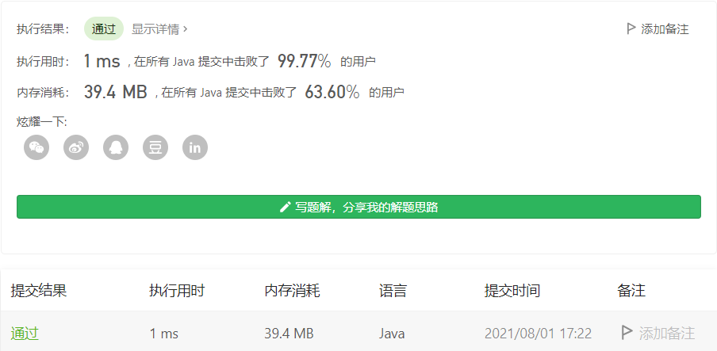

#### 1337. 矩阵中战斗力最弱的 K 行

#### 2021-08-01 LeetCode每日一题

链接：https://leetcode-cn.com/problems/the-k-weakest-rows-in-a-matrix/

标签：**数组、矩阵、哈希表、排序**

> 题目

给你一个大小为 m * n 的矩阵 mat，矩阵由若干军人和平民组成，分别用 1 和 0 表示。

请你返回矩阵中战斗力最弱的 k 行的索引，按从最弱到最强排序。

如果第 i 行的军人数量少于第 j 行，或者两行军人数量相同但 i 小于 j，那么我们认为第 i 行的战斗力比第 j 行弱。

军人 总是 排在一行中的靠前位置，也就是说 1 总是出现在 0 之前。

示例 1：

```java
输入：mat = 
[[1,1,0,0,0],
 [1,1,1,1,0],
 [1,0,0,0,0],
 [1,1,0,0,0],
 [1,1,1,1,1]], 
k = 3
输出：[2,0,3]
解释：
每行中的军人数目：
行 0 -> 2 
行 1 -> 4 
行 2 -> 1 
行 3 -> 2 
行 4 -> 5 
从最弱到最强对这些行排序后得到 [2,0,3,1,4]
```

示例 2：

```java
输入：mat = 
[[1,0,0,0],
 [1,1,1,1],
 [1,0,0,0],
 [1,0,0,0]], 
k = 2
输出：[0,2]
解释： 
每行中的军人数目：
行 0 -> 1 
行 1 -> 4 
行 2 -> 1 
行 3 -> 1 
从最弱到最强对这些行排序后得到 [0,2,3,1]
```


提示：

- m == mat.length
- n == mat[i].length
- 2 <= n, m <= 100
- 1 <= k <= m
- matrix[i][j] 不是 0 就是 1

> 分析

思路1：哈希表，自定义排序。

思路2：借鉴评论区一位大佬的思路，因为矩阵的长度最大为100，所以下标范围是[0, 99]，每行的sum(每个战斗力 * 100) + 下标，就可以得到一个一维数组，数组每一项是每行的战斗力总和，对该数组排序后，每项对100求余即可求出对应的下标了。

> 编码

**思路1**：

```java
class Solution {
    public int[] kWeakestRows(int[][] mat, int k) {
        Map<Integer, Integer> map = new HashMap<>();
        int[] res = new int[k];

        for (int i = 0; i < mat.length; i++) {
            int sum = 0;
            for (int j = 0; j < mat[i].length; j++) {
                if (mat[i][j] == 0) {
                    break;
                }
                sum++;
            }
            map.put(i, sum);
        }

        // 按值升序
        List<Map.Entry<Integer, Integer>> list = new ArrayList<>(map.entrySet());
        Collections.sort(list, (o1, o2) -> {
            return o1.getValue().compareTo(o2.getValue());
        });

        int count = 0;
        for (Map.Entry<Integer, Integer> entry : list) {
            res[count++] = entry.getKey();
            if (count == k) {
                break;
            }
        }

        return res;
    }
}
```


**思路2**：

```java
class Solution {
    public int[] kWeakestRows(int[][] mat, int k) {
        int[] res = new int[k];
        int[] sum = new int[mat.length];

        for (int i = 0; i < mat.length; i++) {
            int s = 0;
            for (int j = 0; j < mat[i].length; j++) {
                if (mat[i][j] == 0) {
                    break;
                }
                s += (mat[i][j] * 100);
            }
            sum[i] = s + i;
        }

        Arrays.sort(sum);
        for (int i = 0; i < k; i++) {
            res[i] = sum[i] % 100;
        }

        return res;
    }
}
```

