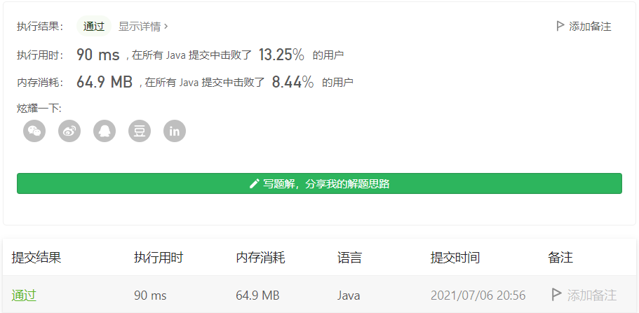

#### 1418. 点菜展示表

#### 2021-07-06 LeetCode每日一题

链接：https://leetcode-cn.com/problems/display-table-of-food-orders-in-a-restaurant/

标签：**数组、哈希表、字符串、有序集合、排序**

> 题目

给你一个数组 orders，表示客户在餐厅中完成的订单，确切地说， orders[i]=[customerNamei,tableNumberi,foodItemi] ，其中 customerNamei 是客户的姓名，tableNumberi 是客户所在餐桌的桌号，而 foodItemi 是客户点的餐品名称。

请你返回该餐厅的 点菜展示表 。在这张表中，表中第一行为标题，其第一列为餐桌桌号 “Table” ，后面每一列都是按字母顺序排列的餐品名称。接下来每一行中的项则表示每张餐桌订购的相应餐品数量，第一列应当填对应的桌号，后面依次填写下单的餐品数量。

注意：客户姓名不是点菜展示表的一部分。此外，表中的数据行应该按餐桌桌号升序排列。

示例 1：

```java
输入：orders = [["David","3","Ceviche"],["Corina","10","Beef Burrito"],["David","3","Fried Chicken"],["Carla","5","Water"],["Carla","5","Ceviche"],["Rous","3","Ceviche"]]
输出：[["Table","Beef Burrito","Ceviche","Fried Chicken","Water"],["3","0","2","1","0"],["5","0","1","0","1"],["10","1","0","0","0"]] 
解释：
点菜展示表如下所示：
Table,Beef Burrito,Ceviche,Fried Chicken,Water
3    ,0           ,2      ,1            ,0
5    ,0           ,1      ,0            ,1
10   ,1           ,0      ,0            ,0
对于餐桌 3：David 点了 "Ceviche" 和 "Fried Chicken"，而 Rous 点了 "Ceviche"
而餐桌 5：Carla 点了 "Water" 和 "Ceviche"
餐桌 10：Corina 点了 "Beef Burrito" 
```

示例 2：

```java
输入：orders = [["James","12","Fried Chicken"],["Ratesh","12","Fried Chicken"],["Amadeus","12","Fried Chicken"],["Adam","1","Canadian Waffles"],["Brianna","1","Canadian Waffles"]]
输出：[["Table","Canadian Waffles","Fried Chicken"],["1","2","0"],["12","0","3"]] 
解释：
对于餐桌 1：Adam 和 Brianna 都点了 "Canadian Waffles"
而餐桌 12：James, Ratesh 和 Amadeus 都点了 "Fried Chicken"
```

示例 3：

```java
输入：orders = [["Laura","2","Bean Burrito"],["Jhon","2","Beef Burrito"],["Melissa","2","Soda"]]
输出：[["Table","Bean Burrito","Beef Burrito","Soda"],["2","1","1","1"]]
```

提示：

- 1 <= orders.length <= 5 * 10^4
- orders[i].length == 3
- 1 <= customerNamei.length, foodItemi.length <= 20
- customerNamei 和 foodItemi 由大小写英文字母及空格字符 ' ' 组成。
- tableNumberi 是 1 到 500 范围内的整数。

> 分析

这题看着就繁琐，但作为调包侠毫不畏惧。


难倒是不难，要理清思路。总结成一句话就是要你求出**每道菜在每桌有几个人点**了，或者是**每一桌点了哪几道菜**。所以我要让桌号、菜品名称、数量三个形成联系。这里我的想法是让桌号和菜品名称作为键、然后数量作为值放入哈希表中，这样就能解决数量的问题，另外就是菜品名称要排序，桌号也要排序。

菜品名称和桌号分别放在一个TreeSet中按自然顺序排序，但这里要注意桌号需要转为数字型，如果是字符串，"10"会排在"3"的前面，这就不对了。

根据题目给的条件，菜品数量范围在[1, 20]，桌号数量范围在[1, 500]，总的订单长度范围是[1, 5 * 10^4]，所以按照上面的思路，应该不会超时，但效率应该不咋地。

> 编码

```java
class Solution {
    public List<List<String>> displayTable(List<List<String>> orders) {
        List<List<String>> res = new ArrayList<>();
        Map<String, Integer> map = new HashMap<>();
        // 存放餐品名称，无重复
        Set<String> foodItems = new TreeSet<>();
        // 存放餐桌，无重复,Integer类型，才能正常排序
        Set<Integer> tables = new TreeSet<>();

        for (int i = 0; i < orders.size(); i++) {
            List<String> list = orders.get(i);
            foodItems.add(list.get(2));
            tables.add(Integer.parseInt(list.get(1)));
            // 桌号 + 餐品名称组成键
            String key = list.get(1) + "_" + list.get(2);
            map.put(key, map.getOrDefault(key, 0) + 1);
        }

        // 标题
        List<String> head = new ArrayList<>();
        head.add("Table");
        head.addAll(foodItems);
        res.add(head);
        for (Integer table : tables) {
            List<String> row = new ArrayList<>();
            row.add(String.valueOf(table));
            for (String foodItem : foodItems) {
                String key = table + "_" + foodItem;
                Integer value = map.get(key) == null ? 0 : map.get(key);
                row.add(String.valueOf(value));
            }
            res.add(row);
        }

        return res;
    }
}
```

