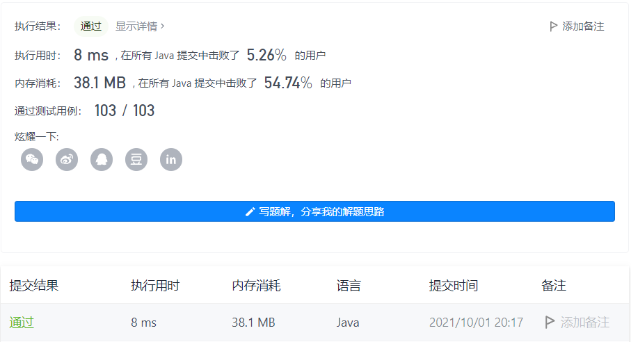
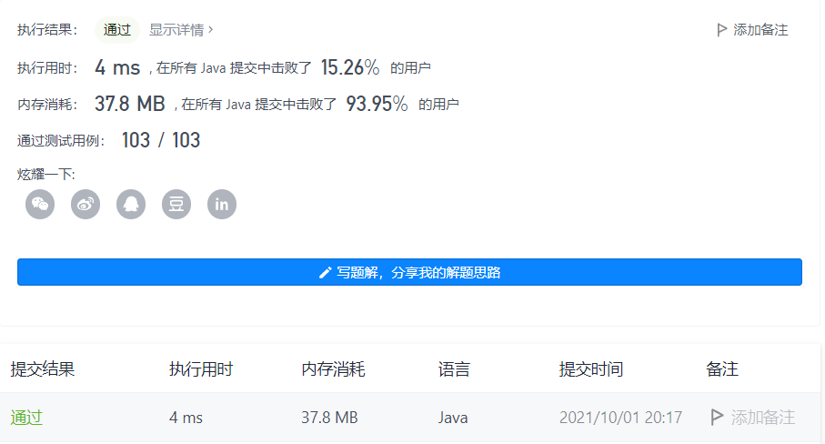
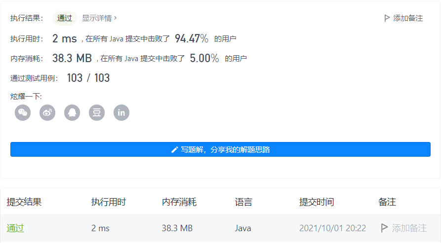
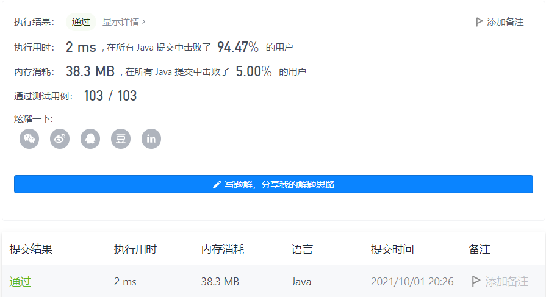

#### 1436. 旅行终点站

#### 2021-10-01 LeetCode每日一题

链接：https://leetcode-cn.com/problems/destination-city/

标签：**字符串、哈希表**

> 题目

给你一份旅游线路图，该线路图中的旅行线路用数组 paths 表示，其中 paths[i] = [cityAi, cityBi] 表示该线路将会从 cityAi 直接前往 cityBi 。请你找出这次旅行的终点站，即没有任何可以通往其他城市的线路的城市。

题目数据保证线路图会形成一条不存在循环的线路，因此恰有一个旅行终点站。

示例 1：

```java
输入：paths = [["London","New York"],["New York","Lima"],["Lima","Sao Paulo"]]
输出："Sao Paulo" 
解释：从 "London" 出发，最后抵达终点站 "Sao Paulo" 。本次旅行的路线是 "London" -> "New York" -> "Lima" -> "Sao Paulo" 。
```

示例 2：

```java
输入：paths = [["B","C"],["D","B"],["C","A"]]
输出："A"
解释：所有可能的线路是：
"D" -> "B" -> "C" -> "A". 
"B" -> "C" -> "A". 
"C" -> "A". 
"A". 
显然，旅行终点站是 "A" 。
```

示例 3：

```java
输入：paths = [["A","Z"]]
输出："Z"
```


提示：

- 1 <= paths.length <= 100
- paths[i].length == 2
- 1 <= cityAi.length, cityBi.length <= 10
- cityAi != cityBi
- 所有字符串均由大小写英文字母和空格字符组成。

> 分析

解法1：双层循环。判断每个到达站是否作为出发站，如果没有，则该站就是终点站。

解法2：可以定义，--> 车站 --> ，如果该车站作为出发站，则权重-1，作为到达站，则权重+1，初始权重为0。可以得出，最后始发站的权重为-1，中间车站的权重为0，终点站的权重大于0。

解法3：所有的出发站作为一个集合1，所有的到达站作为一个集合2。既不存在集合1也不存在集合2的车站肯定是始发站或者终点站，所以只需要取集合2剩下的那个元素就是终点站。

> 编码

解法1：

```java
class Solution {
    public String destCity(List<List<String>> paths) {
        for (int i = 0; i < paths.size(); i++) {
            boolean flag = false;
            String first = paths.get(i).get(1);
            for (int j = 0; j < paths.size(); j++) {
                if (i != j && first.equals(paths.get(j).get(0))) {
                    flag = true;
                }
            }

            if (!flag) {
                return first;
            }
        }

        return null;
    }
}
```



时间复杂度O(N * N)，空间复杂度O(1)

解法2：

```java
class Solution {
    public String destCity(List<List<String>> paths) {
        Map<String, Integer> map = new HashMap<>();
        for (int i = 0; i < paths.size(); i++) {
            String from = paths.get(i).get(0);
            String to = paths.get(i).get(1);
            // 出方向 -1
            map.put(from, map.getOrDefault(from, 0) - 1);
            // 入方向 +1
            map.put(to, map.getOrDefault(to, 0) + 1);
        }

        String res = null;
        for (Map.Entry<String, Integer> entry : map.entrySet()) {
            if (entry.getValue() > 0) {
                res = entry.getKey();
                break;
            }
        }

        return res;
    }
}
```



时间复杂度O(N)，空间复杂度O(N)

解法3：

```java
class Solution {
    public String destCity(List<List<String>> paths) {
        Set<String> set = new HashSet<>();
        for (int i = 0; i < paths.size(); i++) {
            set.add(paths.get(i).get(0));
        }

        for (int i = 0; i < paths.size(); i++) {
            if (!set.contains(paths.get(i).get(1))) {
                return paths.get(i).get(1);
            }
        }

        return null;
    }
}
```



时间复杂度O(N)，空间复杂度O(N)

解法4：

```java
class Solution {
    public String destCity(List<List<String>> paths) {
        Map<String, String> map = new HashMap<>();
        for (List<String> list : paths) {
            map.put(list.get(0), list.get(1));
        }

        String res = paths.get(0).get(1);
        while (map.containsKey(res)) {
            res = map.get(res);
        }

        return res;
    }
}
```



时间复杂度O(N)，空间复杂度O(N)