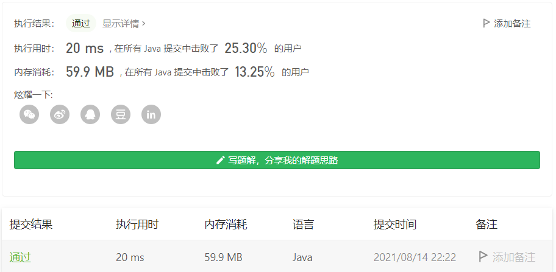

#### 1583. 统计不开心的朋友

#### 2021-08-14 LeetCode每日一题

链接：https://leetcode-cn.com/problems/count-unhappy-friends/

标签：**数组、模拟**

> 题目

给你一份 n 位朋友的亲近程度列表，其中 n 总是 偶数 。

对每位朋友 i，preferences[i] 包含一份 按亲近程度从高到低排列 的朋友列表。换句话说，排在列表前面的朋友与 i 的亲近程度比排在列表后面的朋友更高。每个列表中的朋友均以 0 到 n-1 之间的整数表示。

所有的朋友被分成几对，配对情况以列表 pairs 给出，其中 pairs[i] = [xi, yi] 表示 xi 与 yi 配对，且 yi 与 xi 配对。

但是，这样的配对情况可能会是其中部分朋友感到不开心。在 x 与 y 配对且 u 与 v 配对的情况下，如果同时满足下述两个条件，x 就会不开心：

- x 与 u 的亲近程度胜过 x 与 y，且
- u 与 x 的亲近程度胜过 u 与 v

 返回 不开心的朋友的数目 。

示例 1：

```java
输入：n = 4, preferences = [[1, 2, 3], [3, 2, 0], [3, 1, 0], [1, 2, 0]], pairs = [[0, 1], [2, 3]]
输出：2
解释：
朋友 1 不开心，因为：

- 1 与 0 配对，但 1 与 3 的亲近程度比 1 与 0 高，且
- 3 与 1 的亲近程度比 3 与 2 高。
  朋友 3 不开心，因为：
- 3 与 2 配对，但 3 与 1 的亲近程度比 3 与 2 高，且
- 1 与 3 的亲近程度比 1 与 0 高。
  朋友 0 和 2 都是开心的。
```

示例 2：

```java
输入：n = 2, preferences = [[1], [0]], pairs = [[1, 0]]
输出：0
解释：朋友 0 和 1 都开心。
```

示例 3：

```java
输入：n = 4, preferences = [[1, 3, 2], [2, 3, 0], [1, 3, 0], [0, 2, 1]], pairs = [[1, 3], [0, 2]]
输出：4
```


提示：

- 2 <= n <= 500
- n 是偶数
- preferences.length == n
- preferences[i].length == n - 1
- 0 <= preferences[i][j] <= n - 1
- preferences[i] 不包含 i
- preferences[i] 中的所有值都是独一无二的
- pairs.length == n/2
- pairs[i].length == 2
- xi != yi
- 0 <= xi, yi <= n - 1
- 每位朋友都 恰好 被包含在一对中

> 分析

每个人的亲近程度放在有个数组里，如果我们需要获取两个人的亲近程度是不过太好获取的，所以我们可以把亲近关系放在哈希表里，键是朋友，值是对应的亲近度，这里数值是多少不重要，关键是要能体现高低。

用哈希表存好后，循环遍历即可。

> 编码

```java
class Solution {
    Map<Integer, Map<Integer, Integer>> map = new HashMap<>();
    public int unhappyFriends(int n, int[][] preferences, int[][] pairs) {
        if (n == 2) {
            return 0;
        }
        
        int res = 0, len = pairs.length;
        for (int i = 0; i < n; i++) {
            Map<Integer, Integer> pars = new HashMap<>();
            int[] score = preferences[i];
            for (int j = 0; j < score.length; j++) {
                pars.put(score[j], n - j);
            }
            map.put(i, pars);
        }

        for (int i = 0; i < len; i++) {
            int x = pairs[i][0], y = pairs[i][1];
            boolean xOk = false, yOk = false;
            for (int j = 0; j < len; j++) {
                if (i == j) {
                    continue;
                }
                int a = pairs[j][0], b = pairs[j][1];
                if (!xOk && checkIsOk(x, y, a, b)) {
                    res++;
                    xOk = true;
                }
                if (!yOk && checkIsOk(y, x, a, b)) {
                    res++;
                    yOk = true;
                }
                if (xOk && yOk) {
                    break;
                }
            }
        }

        return res;
    }

    private boolean checkIsOk(int x, int y, int a, int b) {
        Map<Integer, Integer> xMap = map.get(x);
        Map<Integer, Integer> yMap = map.get(y);
        Map<Integer, Integer> aMap = map.get(a);
        Map<Integer, Integer> bMap = map.get(b);
        if (xMap.get(a) > xMap.get(y) && aMap.get(x) > aMap.get(b)) {
            return true;
        }
        if (xMap.get(b) > xMap.get(y) && bMap.get(x) > bMap.get(a)) {
            return true;
        }
        return false;
    }
}
```

