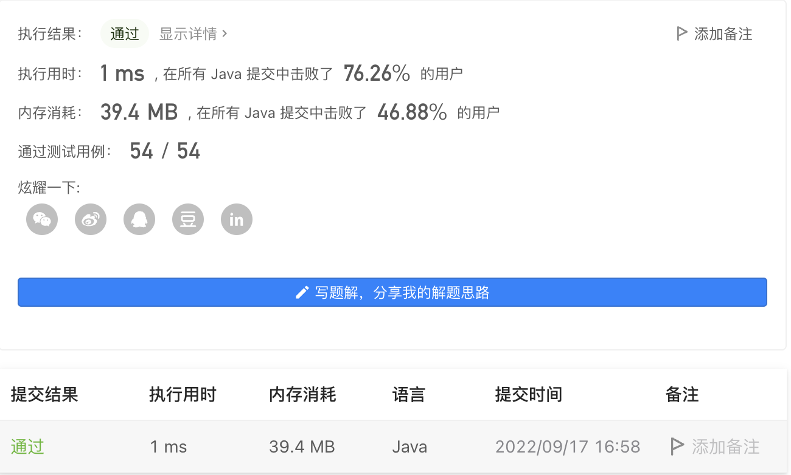

#### 1624. 两个相同字符之间的最长子字符串

#### 2022-09-17 LeetCode每日一题

链接：https://leetcode.cn/problems/largest-substring-between-two-equal-characters/

标签：**字符串、哈希表**

> 题目

给你一个字符串 s，请你返回 两个相同字符之间的最长子字符串的长度 ，计算长度时不含这两个字符。如果不存在这样的子字符串，返回 -1 。

子字符串 是字符串中的一个连续字符序列。

示例 1：

```java
输入：s = "aa"
输出：0
解释：最优的子字符串是两个 'a' 之间的空子字符串。
```

示例 2：

```java
输入：s = "abca"
输出：2
解释：最优的子字符串是 "bc" 。
```

示例 3：

```java
输入：s = "cbzxy"
输出：-1
解释：s 中不存在出现出现两次的字符，所以返回 -1 。
```

示例 4：

```java
输入：s = "cabbac"
输出：4
解释：最优的子字符串是 "abba" ，其他的非最优解包括 "bb" 和 "" 。
```


提示：

- 1 <= s.length <= 300
- s 只含小写英文字母

> 分析

使用哈希表每个字符以及对应的坐标，当碰到相同字符时，判断坐标差和当前坐标差的大小。

> 编码

```java
class Solution {
    public int maxLengthBetweenEqualCharacters(String s) {
        char[] chs = s.toCharArray();
        Map<Character, Integer> map = new HashMap<>();
        int ans = -1;
        for (int i = 0; i < chs.length; i++) {
            if (map.containsKey(chs[i])) {
                ans = Math.max(ans, i - map.get(chs[i]) - 1);
            } else {
                map.put(chs[i], i);
            }
        }

        return ans;
    }
}
```

