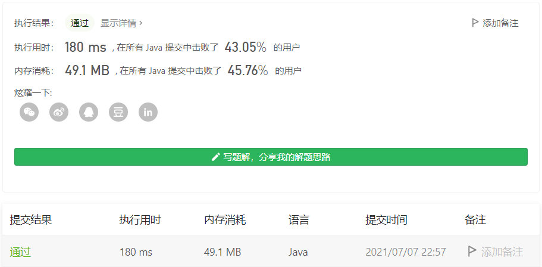

#### 1711. 大餐计数

#### 2021-07-07 LeetCode每日一题

链接：https://leetcode-cn.com/problems/count-good-meals/

标签：**数组、哈希表**

> 题目

大餐 是指 恰好包含两道不同餐品 的一餐，其美味程度之和等于 2 的幂。

你可以搭配 任意 两道餐品做一顿大餐。

给你一个整数数组 deliciousness ，其中 deliciousness[i] 是第 i 道餐品的美味程度，返回你可以用数组中的餐品做出的不同 大餐 的数量。结果需要对 109 + 7 取余。

注意，只要餐品下标不同，就可以认为是不同的餐品，即便它们的美味程度相同。

示例 1：

```java
输入：deliciousness = [1,3,5,7,9]
输出：4
解释：大餐的美味程度组合为 (1,3) 、(1,7) 、(3,5) 和 (7,9) 。
它们各自的美味程度之和分别为 4 、8 、8 和 16 ，都是 2 的幂。
```

示例 2：

```java
输入：deliciousness = [1,1,1,3,3,3,7]
输出：15
解释：大餐的美味程度组合为 3 种 (1,1) ，9 种 (1,3) ，和 3 种 (1,7) 。
```


提示：

- 1 <= deliciousness.length <= 10 ^ 5
- 0 <= deliciousness[i] <= 2 ^ 20

> 分析

此题的意思转换一下就是：求两数之和等于2的幂的方案数。因为题目给的条件是元素范围在[0, 2 ^ 20]，所以2的幂取值就是2 ^ n（0 <= n <= 21）

如果给定的列表里没有重复数字这还好办，直接排序后使用双指针就行，问题是列表里有双指针，这处理起来就有些麻烦了，我用双指针做了下，在倒数第二个用例超时了。

```java
class Solution {
    public int countPairs(int[] deliciousness) {
        Arrays.sort(deliciousness);
        int len = deliciousness.length, res = 0;
        int[] bits = new int[22];
        for (int i = 0; i <= 21; i++) {
            bits[i] = (int)Math.pow(2, i);
        }

        for (int val : bits) {
            int left = 0, right = len - 1;
            while (left < right) {
                int sum = deliciousness[left] + deliciousness[right];

                if (sum == val) {
                    int tempLeft = left, tempRight = right, count = 0;
                    // 处理重复数字
                    while (tempLeft < tempRight && deliciousness[tempLeft] == deliciousness[left]) {
                        while (tempRight > tempLeft && deliciousness[tempRight] == deliciousness[right]) {
                            res = (res + 1) % (1000_000_007);
                            tempRight--;
                        }
                        count = tempRight;
                        tempRight = right;
                        tempLeft++;
                    }

                    left = tempLeft;
                    right = count;
                } else if (sum < val) {
                    left++;
                } else if (sum > val) {
                    right--;
                }
            }
        }

        return res;
    }
}
```

写了一坨，想哭。


因为2的幂取值只有22个数，求两数之和，我们用2的幂减去列表中的元素得到差值，如果差值存在列表中，说明这就是一个答案。

如果按照这个思路：先遍历列表，把元素存入哈希表中，然后再遍历列表，让列表元素和2的幂相减，累加答案。这样最后得到的答案是错误的，因为对于同一对数计算了两次。

所以我们可以在循环过程中边计算边加入哈希表，这样对于同一对数，只会计算一次，答案正确代码又简洁。

> 编码

```java
class Solution {
    public int countPairs(int[] deliciousness) {
        HashMap<Integer, Integer> map = new HashMap<>();
        int ans = 0;
        for(int i = 0; i < deliciousness.length; i++){
            for(int j = 1; j <= 1 << 21; j <<= 1){
                if(map.containsKey(j - deliciousness[i])){
                    ans = (ans + map.get(j - deliciousness[i])) % 1000000007;
                }
            }
            map.put(deliciousness[i], map.getOrDefault(deliciousness[i], 0) + 1);
        }
        return ans;
    }
}
```

