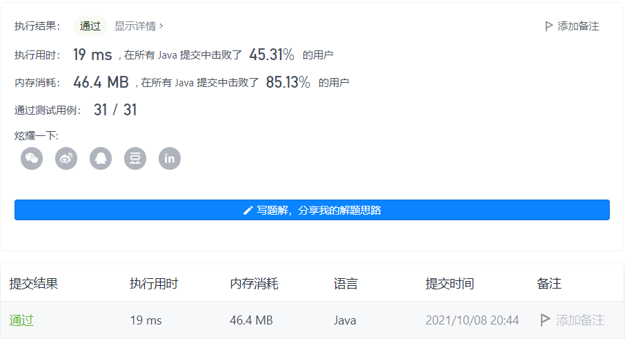

#### 187. 重复的DNA序列

#### 2021-10-08 LeetCode每日一题

链接：https://leetcode-cn.com/problems/repeated-dna-sequences/

标签：**字符串、哈希表、位运算、滑动窗口、哈希函数、滚动哈希**

> 题目

所有 DNA 都由一系列缩写为 'A'，'C'，'G' 和 'T' 的核苷酸组成，例如："ACGAATTCCG"。在研究 DNA 时，识别 DNA 中的重复序列有时会对研究非常有帮助。

编写一个函数来找出所有目标子串，目标子串的长度为 10，且在 DNA 字符串 s 中出现次数超过一次。

示例 1：

```java
输入：s = "AAAAACCCCCAAAAACCCCCCAAAAAGGGTTT"
输出：["AAAAACCCCC","CCCCCAAAAA"]
```

示例 2：

```java
输入：s = "AAAAAAAAAAAAA"
输出：["AAAAAAAAAA"]
```


提示：

- 0 <= s.length <= 105
- s[i] 为 'A'、'C'、'G' 或 'T'

> 分析

题目的意思就是寻找长度为10并且在s中出现次数超过1次的字符串。

这里可以每次截取长度为10的字符串，然后放入哈希表中，如果出现次数超过1，则加入结果集。注意过滤掉重复的。

> 编码

```java
class Solution {
    public List<String> findRepeatedDnaSequences(String s) {
        List<String> res = new ArrayList<>();
        Map<String, Integer> map = new HashMap<>();
        for (int i = 10; i <= s.length(); i++) {
            String str = s.substring(i - 10, i);
            Integer val = map.get(str);
            if (val != null) {
                if (val == 1) {
                    res.add(str);
                }
                map.put(str, val + 1);
            } else {
                map.put(str, 1);
            }
        }

        return res;
    }
}
```



时间复杂度O(N * C)，空间复杂度O(N)。其中N为字符串长度，C等于10。