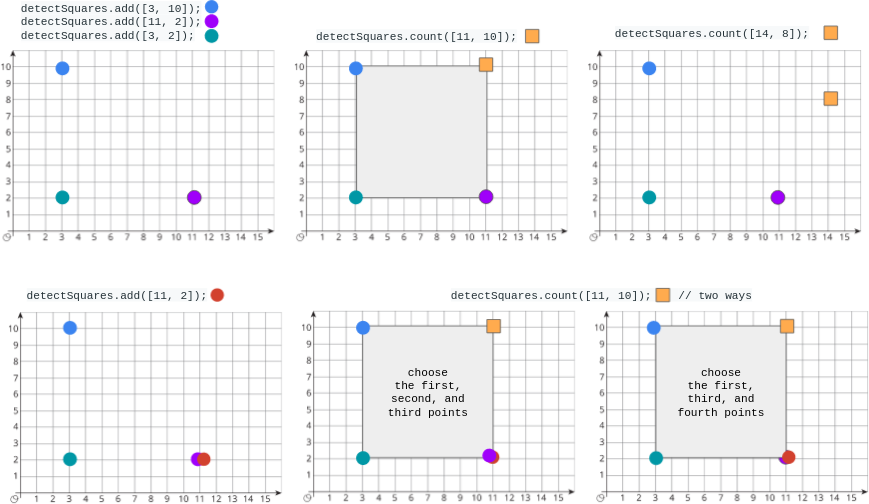
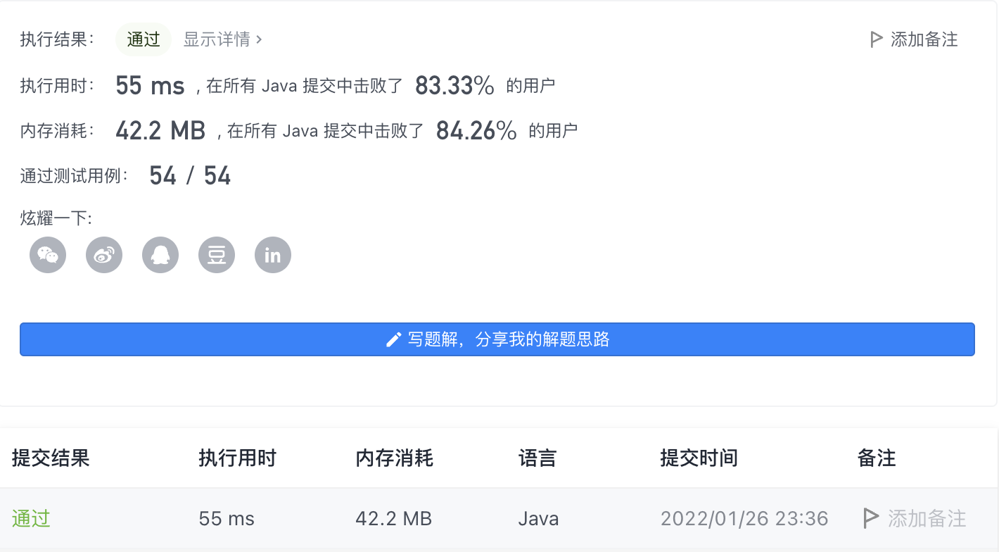

#### 2013. 检测正方形

#### 2022-01-26 LeetCode每日一题

链接：https://leetcode-cn.com/problems/detect-squares/

标签：**设计、数组、哈希表、计数**

> 题目

给你一个在 X-Y 平面上的点构成的数据流。设计一个满足下述要求的算法：

- 添加 一个在数据流中的新点到某个数据结构中。可以添加 重复 的点，并会视作不同的点进行处理。
- 给你一个查询点，请你从数据结构中选出三个点，使这三个点和查询点一同构成一个 面积为正 的 轴对齐正方形 ，统计 满足该要求的方案数目。

轴对齐正方形 是一个正方形，除四条边长度相同外，还满足每条边都与 x-轴 或 y-轴 平行或垂直。

实现 DetectSquares 类：

- DetectSquares() 使用空数据结构初始化对象
- void add(int[] point) 向数据结构添加一个新的点 point = [x, y]
- int count(int[] point) 统计按上述方式与点 point = [x, y] 共同构造 轴对齐正方形 的方案数。

示例：



```java
输入：
["DetectSquares", "add", "add", "add", "count", "count", "add", "count"]
[[], [[3, 10]], [[11, 2]], [[3, 2]], [[11, 10]], [[14, 8]], [[11, 2]], [[11, 10]]]
输出：
[null, null, null, null, 1, 0, null, 2]

解释：
DetectSquares detectSquares = new DetectSquares();
detectSquares.add([3, 10]);
detectSquares.add([11, 2]);
detectSquares.add([3, 2]);
detectSquares.count([11, 10]); // 返回 1 。你可以选择：
                               //   - 第一个，第二个，和第三个点
detectSquares.count([14, 8]);  // 返回 0 。查询点无法与数据结构中的这些点构成正方形。
detectSquares.add([11, 2]);    // 允许添加重复的点。
detectSquares.count([11, 10]); // 返回 2 。你可以选择：
                               //   - 第一个，第二个，和第三个点
                               //   - 第一个，第三个，和第四个点
```


提示：

- point.length == 2
- 0 <= x, y <= 1000
- 调用 add 和 count 的 总次数 最多为 5000

> 分析

因为可以加入相同的点，所以可以使用哈希表进行存储。`Map<Integer, Map<Integer, Integer>>`这样的结构，外层map的键是x坐标，内层map的键是y坐标，值是点(x, y)出现的次数。

确定如何存储后，接下来就是确定有几种方案。对于给定点point(x, y)，可以先找到在横坐标为x的位置上有几个点，然后遍历这些点，每个点和point的x坐标相同，通过y坐标可以计算出该点temp和point的y轴距离len。如果要构成正方形，那么四条边都要相等，所以可以在当前横坐标为x的基础上，向左或者向右移动len距离，确定x轴的差距也等于len。此时只需要计算横坐标为x - len和x + len上点的纵坐标为point(y)和temp(y)的点的个数，然后相乘累加。

> 编码

```java
class DetectSquares {
    // key为x，里面的map，key是y，值是(x, y)出现的次数
    private Map<Integer, Map<Integer, Integer>> datas;
    public DetectSquares() {
        datas = new HashMap<>();
    }
    
    public void add(int[] point) {
        Map<Integer, Integer> map = datas.getOrDefault(point[0], new HashMap<>());
        map.put(point[1], map.getOrDefault(point[1], 0) + 1);
        datas.put(point[0], map);
    }
    
    public int count(int[] point) {
        int ans = 0;

        if (datas.containsKey(point[0])) {
            // 所有与point点在同一横坐标的点
            Map<Integer, Integer> map = datas.get(point[0]);
            for (int key : map.keySet()) {
                // 边的长度
                int len = Math.abs(key - point[1]);
                if (len == 0) {
                    continue;
                }

                // 获取所有横坐标为point[0] + len的点
                if (datas.containsKey(point[0] + len)) {
                    Map<Integer, Integer> temp = datas.get(point[0] + len);
                    ans += temp.getOrDefault(key, 0) * temp.getOrDefault(point[1], 0) * map.get(key);
                }

                // 获取所有横坐标为point[0] - len的点
                if (point[0] - len >= 0 && datas.containsKey(point[0] - len)) {
                    Map<Integer, Integer> temp = datas.get(point[0] - len);
                    ans += temp.getOrDefault(key, 0) * temp.getOrDefault(point[1], 0) * map.get(key);
                }
            }
        }
        return ans;
    }
}

/**
 * Your DetectSquares object will be instantiated and called as such:
 * DetectSquares obj = new DetectSquares();
 * obj.add(point);
 * int param_2 = obj.count(point);
 */
```

