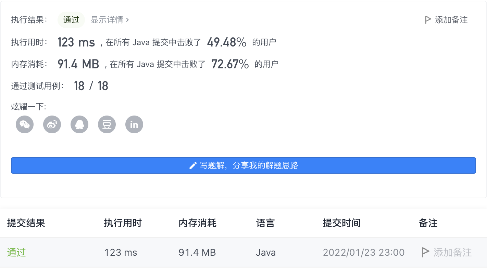

#### 2034. 股票价格波动

#### 2022-01-23 LeetCode每日一题

链接：https://leetcode-cn.com/problems/stock-price-fluctuation/

标签：**哈希表**

> 题目

给你一支股票价格的数据流。数据流中每一条记录包含一个 时间戳 和该时间点股票对应的 价格 。

不巧的是，由于股票市场内在的波动性，股票价格记录可能不是按时间顺序到来的。某些情况下，有的记录可能是错的。如果两个有相同时间戳的记录出现在数据流中，前一条记录视为错误记录，后出现的记录 更正 前一条错误的记录。

请你设计一个算法，实现：

- 更新 股票在某一时间戳的股票价格，如果有之前同一时间戳的价格，这一操作将 更正 之前的错误价格。
- 找到当前记录里 最新股票价格 。最新股票价格 定义为时间戳最晚的股票价格。
- 找到当前记录里股票的 最高价格 。
- 找到当前记录里股票的 最低价格 。

请你实现 StockPrice 类：

- StockPrice() 初始化对象，当前无股票价格记录。
- void update(int timestamp, int price) 在时间点 timestamp 更新股票价格为 price 。
- int current() 返回股票 最新价格 。
- int maximum() 返回股票 最高价格 。
- int minimum() 返回股票 最低价格 。


示例 1：

```java
输入：
["StockPrice", "update", "update", "current", "maximum", "update", "maximum", "update", "minimum"]
[[], [1, 10], [2, 5], [], [], [1, 3], [], [4, 2], []]
输出：
[null, null, null, 5, 10, null, 5, null, 2]

解释：
StockPrice stockPrice = new StockPrice();
stockPrice.update(1, 10); // 时间戳为 [1] ，对应的股票价格为 [10] 。
stockPrice.update(2, 5);  // 时间戳为 [1,2] ，对应的股票价格为 [10,5] 。
stockPrice.current();     // 返回 5 ，最新时间戳为 2 ，对应价格为 5 。
stockPrice.maximum();     // 返回 10 ，最高价格的时间戳为 1 ，价格为 10 。
stockPrice.update(1, 3);  // 之前时间戳为 1 的价格错误，价格更新为 3 。
                          // 时间戳为 [1,2] ，对应股票价格为 [3,5] 。
stockPrice.maximum();     // 返回 5 ，更正后最高价格为 5 。
stockPrice.update(4, 2);  // 时间戳为 [1,2,4] ，对应价格为 [3,5,2] 。
stockPrice.minimum();     // 返回 2 ，最低价格时间戳为 4 ，价格为 2 。
```


提示：

- 1 <= timestamp, price <= 10 ^ 9 
- update，current，maximum 和 minimum 总 调用次数不超过 10 ^ 5 。
- current，maximum 和 minimum 被调用时，update 操作 至少 已经被调用过 一次 。

> 分析

（1）对于current，用一个变量记录最大时间戳，然后直接取出就行。

（2）对于`maximum`和`minimum`，用一个HashMap和TreeMap进行记录。HashMap记录时间戳和值的对应关系，TreeMap记录值以及值出现的次数。遍历时，如果对应的timestamp在HashMap中存在，则需要更新值；如果对应的值出现次数为1，则需要在TreeMap中移除对应的值；如果次数不为1，则进行减1操作。

> 编码

```java
class StockPrice {
    // key -> timestamp, value -> price
    private Map<Integer, Integer> map1;
    // key -> price, value -> count
    private TreeMap<Integer, Integer> map2;
    // 记录最大时间戳
    private Integer maxTimestamp;

    public StockPrice() {
        map1 = new HashMap<>();
        map2 = new TreeMap<>();
        maxTimestamp = 0;
    }
    
    public void update(int timestamp, int price) {
        maxTimestamp = Math.max(maxTimestamp, timestamp);
        if (map1.containsKey(timestamp)) {
            Integer key = map1.get(timestamp);
            Integer val = map2.get(key);
            if (val == 1) {
                map2.remove(key);
            } else {
                map2.put(key, map2.get(key) - 1);
            }
        }
        map1.put(timestamp, price);
        map2.put(price, map2.getOrDefault(price, 0) + 1);
    }
    
    public int current() {
        return map1.get(maxTimestamp);
    }
    
    public int maximum() {
        return map2.lastKey();
    }
    
    public int minimum() {
        return map2.firstKey();
    }
}

/**
 * Your StockPrice object will be instantiated and called as such:
 * StockPrice obj = new StockPrice();
 * obj.update(timestamp,price);
 * int param_2 = obj.current();
 * int param_3 = obj.maximum();
 * int param_4 = obj.minimum();
 */
```

