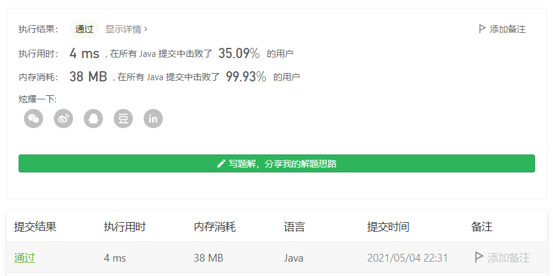

#### 349. 两个数组的交集

链接：https://leetcode-cn.com/problems/intersection-of-two-arrays/

```java
class Solution {
    public int[] intersection(int[] nums1, int[] nums2) {
        // 共同元素的个数
        int count = 0;

        Map<Integer, Integer> map = new HashMap<>();
        // 数组nums1，去掉重复元素
        for (int num : nums1) {
            if (map.containsKey(num)) {
                continue;
            }
            map.put(num, 1);
        }

        for (int num : nums2) {
            // 如果map中包含并且个数为1
            if (map.containsKey(num) && map.get(num) == 1) {
                count++;
                map.put(num, 2);
            }
        }

        int[] res = new int[count];
        count = 0;
        for (Map.Entry<Integer, Integer> entry : map.entrySet()) {
            if (entry.getValue() == 2) {
                res[count++] = entry.getKey();
            }
        }

        return res;
    }
}
```

