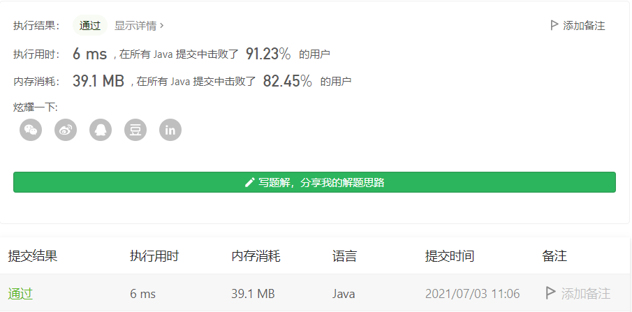

#### 451. 根据字符出现频率排序

#### 2021-07-03 LeetCode每日一题

链接：https://leetcode-cn.com/problems/sort-characters-by-frequency/

标签：**哈希表、字符串、桶排序、计数、排序、堆（优先队列）**

> 题目

给定一个字符串，请将字符串里的字符按照出现的频率降序排列。

示例 1:

```java
输入:
"tree"

输出:
"eert"

解释:
'e'出现两次，'r'和't'都只出现一次。
因此'e'必须出现在'r'和't'之前。此外，"eetr"也是一个有效的答案。
```

示例 2:

```java
输入:
"cccaaa"

输出:
"cccaaa"

解释:
'c'和'a'都出现三次。此外，"aaaccc"也是有效的答案。
注意"cacaca"是不正确的，因为相同的字母必须放在一起。
```

示例 3:

```java
输入:
"Aabb"

输出:
"bbAa"

解释:
此外，"bbaA"也是一个有效的答案，但"Aabb"是不正确的。
注意'A'和'a'被认为是两种不同的字符。
```

> 题目

本题有很多方法可以做

方法1：使用哈希表记录每个字符出现的次数，然后按次数降序排序，最后拼接成字符串返回即可。因为这里我使用字符做键、出现的次数做值，所以其实没必要使用TreeMap这种数据结构，直接使用HashMap，因为最后是要按值排序的。

方法2：使用二维数组求解，因为字符的范围在[0, 127]，所以可以使用一个长度为128的二维数组，记录下字符和出现的次数，然后进行排序即可。

> 编码

**哈希表**：

```java
class Solution {
    public String frequencySort(String s) {
        Map<Character, Integer> map = new HashMap<>();
        char[] chs = s.toCharArray();
        StringBuilder sb = new StringBuilder();

        for (int i = 0; i < chs.length; i++) {
            map.put(chs[i], map.getOrDefault(chs[i], 0) + 1);
        }
        // 按值降序
        List<Map.Entry<Character, Integer>> list = new ArrayList<>(map.entrySet());
        Collections.sort(list, (o1, o2) -> {
            return o2.getValue().compareTo(o1.getValue());
        });

        for (Map.Entry<Character, Integer> entry : list) {
            int count = entry.getValue();
            Character c = entry.getKey();
            for (int i = 0; i < count; i++) {
                sb.append(c);
            }
        }

        return sb.toString();
    }
}
```


**数组**：

```java
class Solution {
    public String frequencySort(String s) {
        int[][] vals = new int[128][2];
        char[] chs = s.toCharArray();
        StringBuilder sb = new StringBuilder();

        for (int i = 0; i < chs.length; i++) {
            vals[chs[i]][0] = chs[i];
            vals[chs[i]][1]++;
        }
        
        Arrays.sort(vals, (a, b) -> {
            if (a[1] != b[1]) {
                return b[1] - a[1];
            }
            return a[0] - b[0];
        });

        for (int i = 0; i < vals.length; i++) {
            int[] val = vals[i];
            while (val[1]-- > 0) {
                sb.append((char)val[0]);
            }
        }

        return sb.toString();
    }
}
```

