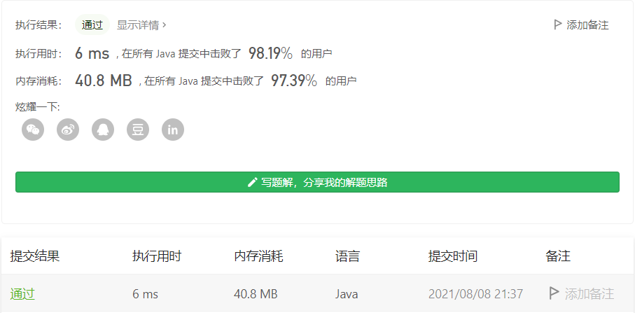

#### 49. 字母异位词分组

链接：https://leetcode-cn.com/problems/group-anagrams/

标签：**哈希表、字符串、排序**

> 题目

给定一个字符串数组，将字母异位词组合在一起。可以按任意顺序返回结果列表。

字母异位词指字母相同，但排列不同的字符串。

示例 1:

```java
输入: strs = ["eat", "tea", "tan", "ate", "nat", "bat"]
输出: [["bat"],["nat","tan"],["ate","eat","tea"]]
```

示例 2:

```java
输入: strs = [""]
输出: [[""]]
```

示例 3:

```java
输入: strs = ["a"]
输出: [["a"]]
```


提示：

- 1 <= strs.length <= 104
- 0 <= strs[i].length <= 100
- strs[i] 仅包含小写字母

> 分析

如果是字母异位词，那么每个字符串按自然顺序排序后的结果都是相同的。所以我们可以把排序后结果相同的字符串放到一起，就可以得到结果。

> 编码

```java
class Solution {
    public List<List<String>> groupAnagrams(String[] strs) {
        List<List<String>> res = new ArrayList<>();
        Map<String, List<String>> map = new HashMap<>();

        for (String str : strs) {
            char[] chs = str.toCharArray();
            Arrays.sort(chs);
            String key = new String(chs);
            List<String> vals = new ArrayList<>();
            if (map.containsKey(key)) {
                vals = map.get(key);
            }
            vals.add(str);
            map.put(key, vals);
        }
        map.forEach((key, val) -> {
            res.add(val);
        });
        
        return res;
    }
}
```

