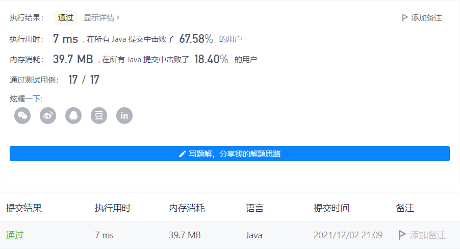

#### 506. 相对名次

#### 2021-12-02 LeetCode每日一题

链接：https://leetcode-cn.com/problems/relative-ranks/

标签：**数组、排序、堆**

> 题目

给你一个长度为 n 的整数数组 score ，其中 score[i] 是第 i 位运动员在比赛中的得分。所有得分都 互不相同 。

运动员将根据得分 决定名次 ，其中名次第 1 的运动员得分最高，名次第 2 的运动员得分第 2 高，依此类推。运动员的名次决定了他们的获奖情况：

- 名次第 1 的运动员获金牌 "Gold Medal" 。
- 名次第 2 的运动员获银牌 "Silver Medal" 。
- 名次第 3 的运动员获铜牌 "Bronze Medal" 。
- 从名次第 4 到第 n 的运动员，只能获得他们的名次编号（即，名次第 x 的运动员获得编号 "x"）。

使用长度为 n 的数组 answer 返回获奖，其中 answer[i] 是第 i 位运动员的获奖情况。

示例 1：

```java
输入：score = [5,4,3,2,1]
输出：["Gold Medal","Silver Medal","Bronze Medal","4","5"]
解释：名次为 [1st, 2nd, 3rd, 4th, 5th] 。
```

示例 2：

```java
输入：score = [10,3,8,9,4]
输出：["Gold Medal","5","Bronze Medal","Silver Medal","4"]
解释：名次为 [1st, 5th, 3rd, 2nd, 4th] 。
```


提示：

- n == score.length
- 1 <= n <= 10 ^ 4
- 0 <= score[i] <= 10 ^ 6
- score 中的所有值 互不相同

> 分析

因为每个运动员的得分互不相同，所以可以使用TreeMap，key为score，value是index，并且按key自然排序。然后遍历map，如果是前三名则分别是"Gold Medal" ，"Silver Medal"，"Bronze Medal"，其他名词就是对应的value。

> 编码

```java
class Solution {
    public String[] findRelativeRanks(int[] score) {
        Map<Integer, Integer> map = new TreeMap<>();
        int len = score.length;
        String[] res = new String[len];
        
        for (int i = 0; i < len; i++) {
            map.put(score[i], i);
        }

        int count = len;
        for (Map.Entry<Integer, Integer> entry : map.entrySet()) {
            if (count == 3) {
                res[entry.getValue()] = "Bronze Medal";
            } else if (count == 2) {
                res[entry.getValue()] = "Silver Medal";
            } else if (count == 1) {
                res[entry.getValue()] = "Gold Medal";
            } else {
                res[entry.getValue()] = String.valueOf(count);
            }
            count--;
        }

        return res;
    }
}
```

