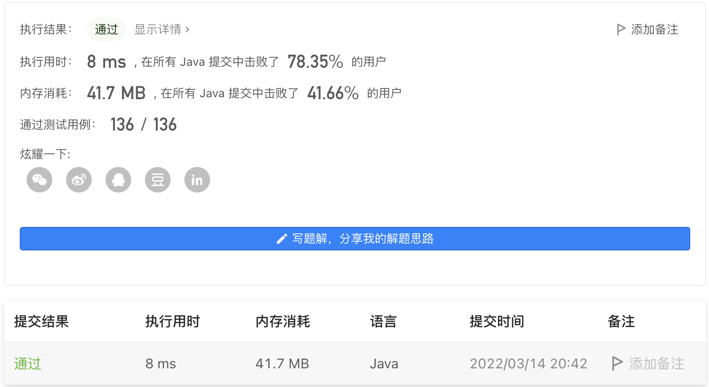

#### 599. 两个列表的最小索引总和

#### 2022-03-14 LeetCode每日一题

链接：https://leetcode-cn.com/problems/minimum-index-sum-of-two-lists/

标签：**数组、哈希表、字符串**

> 题目

假设 Andy 和 Doris 想在晚餐时选择一家餐厅，并且他们都有一个表示最喜爱餐厅的列表，每个餐厅的名字用字符串表示。

你需要帮助他们用最少的索引和找出他们共同喜爱的餐厅。 如果答案不止一个，则输出所有答案并且不考虑顺序。 你可以假设答案总是存在。

示例 1:

```java
输入: list1 = ["Shogun", "Tapioca Express", "Burger King", "KFC"]，list2 = ["Piatti", "The Grill at Torrey Pines", "Hungry Hunter Steakhouse", "Shogun"]
输出: ["Shogun"]
解释: 他们唯一共同喜爱的餐厅是“Shogun”。
```

示例 2:

```java
输入:list1 = ["Shogun", "Tapioca Express", "Burger King", "KFC"]，list2 = ["KFC", "Shogun", "Burger King"]
输出: ["Shogun"]
解释: 他们共同喜爱且具有最小索引和的餐厅是“Shogun”，它有最小的索引和1(0+1)。
```


提示:

- 1 <= list1.length, list2.length <= 1000
- 1 <= list1[i].length, list2[i].length <= 30 
- list1[i] 和 list2[i] 由空格 ' ' 和英文字母组成。
- list1 的所有字符串都是 唯一 的。
- list2 中的所有字符串都是 唯一 的。

> 分析

可以使用哈希表记录list1的所有元素及对应的下标。然后遍历list2，然后元素val在哈希表中存在，那么判断val在list1和list2中的下标总和是否小于当前最小的下标总和index，如果小于，则清空结果集，然后把val加入结果集。如果下标总和等于当前最小的下标总和index，则把val加入结果集的末尾。如果大于，则跳过。

> 编码

```java
class Solution {
    public String[] findRestaurant(String[] list1, String[] list2) {
        StringBuilder sb = new StringBuilder();
        // 记录字符串及对应的下标
        Map<String, Integer> map = new HashMap<>();
        for (int i = 0; i < list1.length; i++) {
            map.put(list1[i], i);
        }

        int index = Integer.MAX_VALUE;
        for (int i = 0; i < list2.length; i++) {
            if (map.containsKey(list2[i])) {
                Integer val = map.get(list2[i]);
                if (i + val < index) {
                    sb = new StringBuilder();
                    index = val + i;
                    sb.append(list2[i]).append(",");
                } else if (i + val == index) {
                    sb.append(list2[i]).append(",");
                }
            }
        }

        return sb.substring(0, sb.length() - 1).split(",");
    }
}
```

