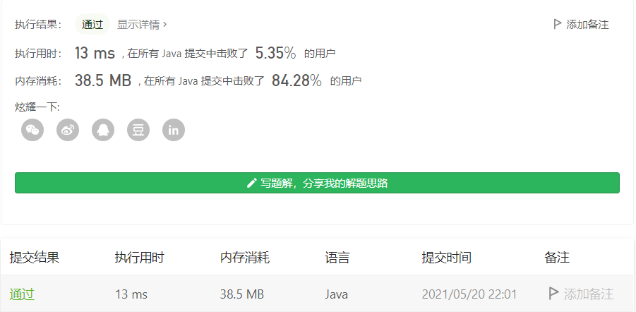
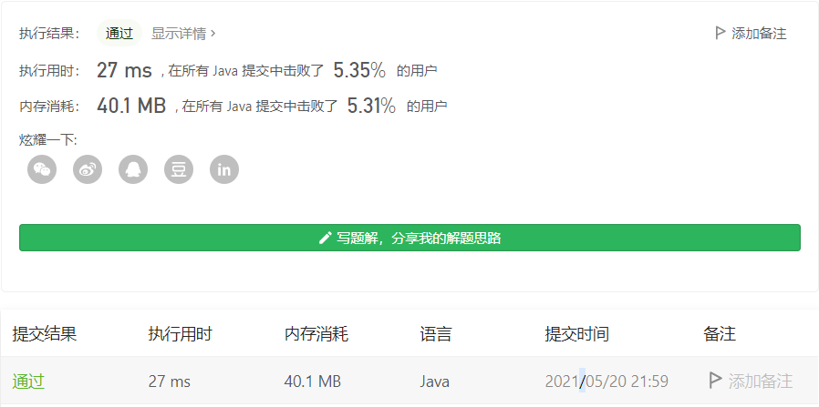
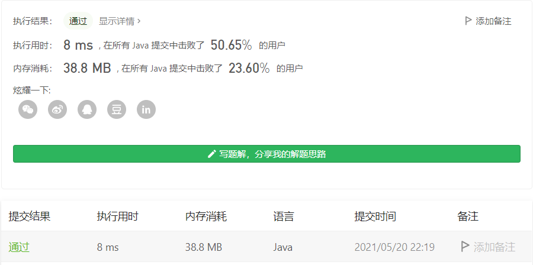

#### 692. 前K个高频单词

链接：https://leetcode-cn.com/problems/top-k-frequent-words/

标签：**堆、字典序、哈希表**

> 题目

给一非空的单词列表，返回前 *k* 个出现次数最多的单词。

返回的答案应该按单词出现频率由高到低排序。如果不同的单词有相同出现频率，按字母顺序排序。

```java
输入: ["i", "love", "leetcode", "i", "love", "coding"], k = 2
输出: ["i", "love"]
解析: "i" 和 "love" 为出现次数最多的两个单词，均为2次。
    注意，按字母顺序 "i" 在 "love" 之前。

输入: ["the", "day", "is", "sunny", "the", "the", "the", "sunny", "is", "is"], k = 4
输出: ["the", "is", "sunny", "day"]
解析: "the", "is", "sunny" 和 "day" 是出现次数最多的四个单词，
    出现次数依次为 4, 3, 2 和 1 次。

假定 k 总为有效值， 1 ≤ k ≤ 集合元素数。
输入的单词均由小写字母组成。
```

尝试以 *O*(*n* log *k*) 时间复杂度和 *O*(*n*) 空间复杂度解决。

> 分析

题目很好理解，关键题目说***O*(*n* log *k*) 时间复杂度和 *O*(*n*) 空间复杂度**，这个臣妾恐怕办不到啊。按照我的思路，拿个TreeMap存它，关键是TreeMap是按照键排序的啊，那让它按值排序不就行了吗？听起来好像是个不错的想法，实现起来也不难，那就干它。

```java
class Solution {
    public List<String> topKFrequent(String[] words, int k) {
		// 按键升序排序
		Map<String, Integer> map = new TreeMap<>();
		List<String> res = new ArrayList<>(k);

		for (String word : words) {
			map.put(word, map.getOrDefault(word, 0) + 1);
		}

		// 按值降序
		List<Map.Entry<String, Integer>> list = new ArrayList<>(map.entrySet());
		Collections.sort(list, (o1, o2) -> {
			// map已经默认按键升序，所以这里只需要判断值即可
			return o2.getValue().compareTo(o1.getValue());
		});

		for (Map.Entry<String, Integer> entry : list) {
			if (--k < 0) {
                break;
			}
			res.add(entry.getKey());
		}

		return res;
	}
}
```



这个如果用lambda写的话，一行就O了。

```java
class Solution {
    public List<String> topKFrequent(String[] words, int k) {
		return Arrays.stream(words)
            .parallel()
            .collect(Collectors.groupingBy(Function.identity(), Collectors.counting()))
            .entrySet()
            .stream()
            .sorted(Comparator.<Map.Entry<String, Long>>comparingLong(Map.Entry::getValue)
            .reversed().thenComparing(Map.Entry::getKey))
            .limit(k)
            .map(Map.Entry::getKey)
            .collect(Collectors.toList());      
	}
}
```



但这个结果不咋地。不过看起来这个13ms和27ms击败率已经没啥区别了，都属于垫底的。

这里也可以使用优先级队列来存储，在构造函数里传入排序函数即可。和上面的写法意思大致一样。

```java
class Solution {
    public List<String> topKFrequent(String[] words, int k) {
		Map<String, Integer> map = new HashMap<>();
		List<String> res = new ArrayList<>(k);

		for (String word : words) {
			map.put(word, map.getOrDefault(word, 0) + 1);
		}

		// 优先权队列，指定排序规则
		PriorityQueue<String> queue = new PriorityQueue<>((o1, o2) -> 
            // 这里map.get(o1)和map.get(o2)比较要使用equals，因为在[-128, 127]之间，==才返回true
            map.get(o1).equals(map.get(o2)) ? o1.compareTo(o2) : map.get(o2) - map.get(o1)
        );
		
        for (String values : map.keySet()) {
            queue.add(values);
        }

		while (!queue.isEmpty()) {
            if (--k < 0) {
                break;
            }

            res.add(queue.poll());
        }

		return res;
	}
}
```

