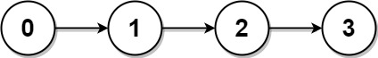
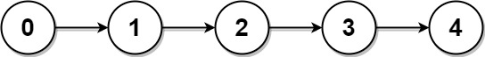

#### 817. 链表组件

#### 2022-10-12 LeetCode每日一题

链接：https://leetcode.cn/problems/linked-list-components/

标签：**数组、哈希表、链表**

> 题目

给定链表头结点 head，该链表上的每个结点都有一个 唯一的整型值 。同时给定列表 nums，该列表是上述链表中整型值的一个子集。

返回列表 nums 中组件的个数，这里对组件的定义为：链表中一段最长连续结点的值（该值必须在列表 nums 中）构成的集合。

示例 1：



```java
输入: head = [0,1,2,3], nums = [0,1,3]
输出: 2
解释: 链表中,0 和 1 是相连接的，且 nums 中不包含 2，所以 [0, 1] 是 nums 的一个组件，同理 [3] 也是一个组件，故返回 2。
```

示例 2：

 

```java
输入: head = [0,1,2,3,4], nums = [0,3,1,4]
输出: 2
解释: 链表中，0 和 1 是相连接的，3 和 4 是相连接的，所以 [0, 1] 和 [3, 4] 是两个组件，故返回 2。
```


提示：

- 链表中节点数为n
- 1 <= n <= 10 ^ 4
- 0 <= Node.val < n
- Node.val 中所有值 不同
- 1 <= nums.length <= n
- 0 <= nums[i] < n
- nums 中所有值 不同

> 分析

可以使用哈希表记录数组中的所有数字，然后循环链表，查询数字是否在哈希表中存在。

> 编码

```java
/**
 * Definition for singly-linked list.
 * public class ListNode {
 *     int val;
 *     ListNode next;
 *     ListNode() {}
 *     ListNode(int val) { this.val = val; }
 *     ListNode(int val, ListNode next) { this.val = val; this.next = next; }
 * }
 */
class Solution {
    public int numComponents(ListNode head, int[] nums) {
        Map<Integer, Integer> map = new HashMap<>(nums.length);
        for (int num : nums) {
            map.put(num, 1);
        }

        int count = 0;
        boolean flag = false;
        while (head != null) {
            if (map.containsKey(head.val)) {
                flag = true;
            } else {
                if (flag) {
                    count++;
                }
                flag = false;
            }
            head = head.next;
        }
        return flag ? count + 1 : count;
    }
}
```


```go
/**
 * Definition for singly-linked list.
 * type ListNode struct {
 *     Val int
 *     Next *ListNode
 * }
 */
func numComponents(head *ListNode, nums []int) int {
    arr := make([]bool, 10000)
    for _, num := range nums {
        arr[num] = true
    }

    count := 0
    flag := false
    for ; head != nil; head = head.Next {
        if arr[head.Val] {
            flag = true
        } else {
            if flag {
                count++
            }
            flag = false
        }
    }
    if flag {
        count++
    }
    return count
}
```

