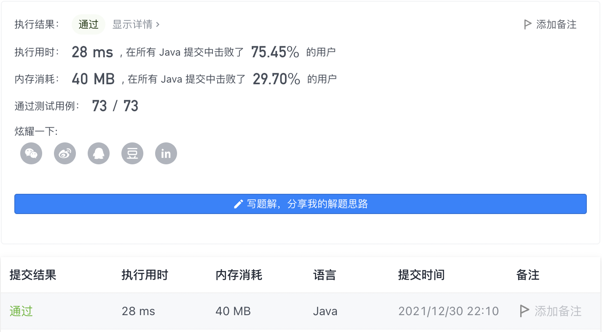
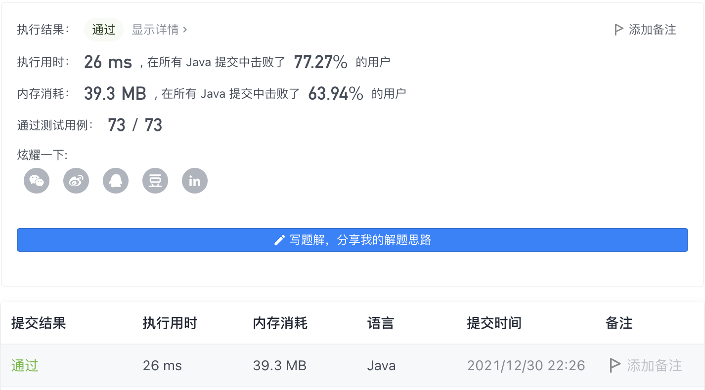

#### 846. 一手顺子

#### 2021-12-30 LeetCode每日一题

链接：https://leetcode-cn.com/problems/hand-of-straights/

标签：**数组、哈希表、排序**

> 题目

Alice 手中有一把牌，她想要重新排列这些牌，分成若干组，使每一组的牌数都是 groupSize ，并且由 groupSize 张连续的牌组成。

给你一个整数数组 hand 其中 hand[i] 是写在第 i 张牌，和一个整数 groupSize 。如果她可能重新排列这些牌，返回 true ；否则，返回 false 。

示例 1：

```java
输入：hand = [1,2,3,6,2,3,4,7,8], groupSize = 3
输出：true
解释：Alice 手中的牌可以被重新排列为 [1,2,3]，[2,3,4]，[6,7,8]。
```

示例 2：

```java
输入：hand = [1,2,3,4,5], groupSize = 4
输出：false
解释：Alice 手中的牌无法被重新排列成几个大小为 4 的组。
```


提示：

- 1 <= hand.length <= 10 ^ 4
- 0 <= hand[i] <= 10 ^ 9
- 1 <= groupSize <= hand.length

> 分析

解法1：先排序，然后用哈希表记录每个数出现的次数。

从hand[0]开始循环判断，周期为groupSize，在这过程中记录**第一次出现的重复数字**作为下一个周期的起始数字。

如果在周期开始时在哈希表中找不到起始数字，则将起始数字赋值为hand数组对应下标的数。

这种解法很容易遗漏情况，并且写法比较丑。

解法2：也是先排序然后用哈希表记录每个数出现的次数。和上面的思路一样，就是写法比较优雅。

> 编码

```java
class Solution {
    public boolean isNStraightHand(int[] hand, int groupSize) {
        if (hand.length % groupSize != 0) {
            return false;
        }
        Arrays.sort(hand);
        Map<Integer, Integer> map = new HashMap<>();
        for (int i = 0; i < hand.length; i++) {
            map.put(hand[i], map.getOrDefault(hand[i], 0) + 1);
        }
        
        int count = groupSize, num = hand[0], repeat = 0;
        boolean flag = true;
        for (int i = 0; i < hand.length; i++) {
            if (count <= 0) {
                count = groupSize;
                // 从上一次重复的数字开始
                if (!flag) {
                    num = repeat;
                }
                flag = true;
            }
            // count开始时找不到第一张牌
            if (!map.containsKey(num) && count == groupSize) {
                num = hand[i];
            }

            if (map.containsKey(num) && map.get(num) > 0) {
                map.put(num, map.get(num) - 1);
            } else {
                return false;
            }

            // 重复数字
            if (flag && map.get(num) > 0) {
                repeat = num;
                flag = false;
            }
            count--;
            num++;
        }

        return true;
    }
}
```



```java
class Solution {
    public boolean isNStraightHand(int[] hand, int groupSize) {
        if (hand.length % groupSize != 0) {
            return false;
        }
        Arrays.sort(hand);
        Map<Integer, Integer> map = new HashMap<>();
        for (int i = 0; i < hand.length; i++) {
            map.put(hand[i], map.getOrDefault(hand[i], 0) + 1);
        }
        
        for (int i = 0; i < hand.length; i++) {
            if (map.containsKey(hand[i]) && map.get(hand[i]) == 0) {
                continue;
            }
            for (int j = 0; j < groupSize; j++) {
                if (!map.containsKey(hand[i] + j)) {
                    return false;
                }
                map.put(hand[i] + j, map.get(hand[i] + j) - 1);
            }
        }

        return true;
    }
}
```

