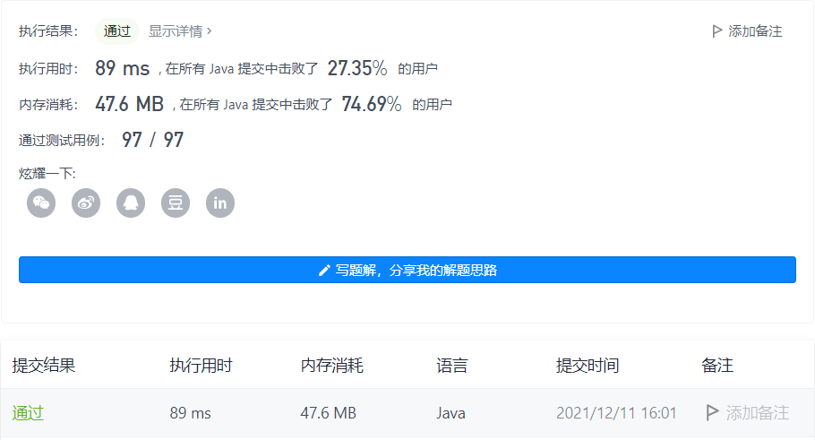

#### 911. 在线选举

#### 2021-12-11 LeetCode每日一题

链接：https://leetcode-cn.com/problems/online-election/

标签：**设计、数组、哈希表、二分查找**

> 题目

给你两个整数数组 persons 和 times 。在选举中，第 i 张票是在时刻为 times[i] 时投给候选人 persons[i] 的。

对于发生在时刻 t 的每个查询，需要找出在 t 时刻在选举中领先的候选人的编号。

在 t 时刻投出的选票也将被计入我们的查询之中。在平局的情况下，最近获得投票的候选人将会获胜。

实现 TopVotedCandidate 类：

- TopVotedCandidate(int[] persons, int[] times) 使用 persons 和 times 数组初始化对象。
- int q(int t) 根据前面描述的规则，返回在时刻 t 在选举中领先的候选人的编号。

示例：

输入：

```java
["TopVotedCandidate", "q", "q", "q", "q", "q", "q"]
[[[0, 1, 1, 0, 0, 1, 0], [0, 5, 10, 15, 20, 25, 30]], [3], [12], [25], [15], [24], [8]]
输出：
[null, 0, 1, 1, 0, 0, 1]

解释：
TopVotedCandidate topVotedCandidate = new TopVotedCandidate([0, 1, 1, 0, 0, 1, 0], [0, 5, 10, 15, 20, 25, 30]);
topVotedCandidate.q(3); // 返回 0 ，在时刻 3 ，票数分布为 [0] ，编号为 0 的候选人领先。
topVotedCandidate.q(12); // 返回 1 ，在时刻 12 ，票数分布为 [0,1,1] ，编号为 1 的候选人领先。
topVotedCandidate.q(25); // 返回 1 ，在时刻 25 ，票数分布为 [0,1,1,0,0,1] ，编号为 1 的候选人领先。（在平局的情况下，1 是最近获得投票的候选人）。
topVotedCandidate.q(15); // 返回 0
topVotedCandidate.q(24); // 返回 0
topVotedCandidate.q(8); // 返回 1
```


提示：

- 1 <= persons.length <= 5000
- times.length == persons.length
- 0 <= persons[i] < persons.length
- 0 <= times[i] <= 10 ^ 9
- times 是一个严格递增的有序数组
- times[0] <= t <= 10 ^ 9
- 每个测试用例最多调用 10 ^ 4 次 q

> 分析

可以记录在每个时间点对应票数最多的选举人编号，然后再q函数中，只需要判断时间t处于哪个时间点，然后取对应的候选人编号就行。

> 编码

```java
class TopVotedCandidate {
    Map<Integer, Integer> map = new HashMap<>();
    int[] times;

    public TopVotedCandidate(int[] persons, int[] times) {
        int max = 0, person = 0;
        this.times = times;
        Map<Integer, Integer> count = new HashMap<>();
        for (int i = 0; i < persons.length; i++) {
            count.put(persons[i], count.getOrDefault(persons[i], 0) + 1);
            // 记录times[i]时间对应票数最多的选举人编号
            if (count.get(persons[i]) >= max) {
                max = count.get(persons[i]);
                person = persons[i];
                map.put(times[i], persons[i]);
            } else {
                map.put(times[i], person);
            }
        }
    }
    
    public int q(int t) {
        int left = 0, right = this.times.length - 1;
        while (left < right) {
            int mid = left + (right - left) / 2;
            if (t > this.times[mid]) {
                if (mid + 1 < this.times.length && t < this.times[mid + 1]) {
                    return map.get(this.times[mid]);
                } else {
                    left = mid + 1;
                }
            } else if (t < this.times[mid]) {
                right = mid;
            } else {
                return map.get(this.times[mid]);
            }
        }
        
        return map.get(this.times[left]);
    }
}

/**
 * Your TopVotedCandidate object will be instantiated and called as such:
 * TopVotedCandidate obj = new TopVotedCandidate(persons, times);
 * int param_1 = obj.q(t);
 */
```

