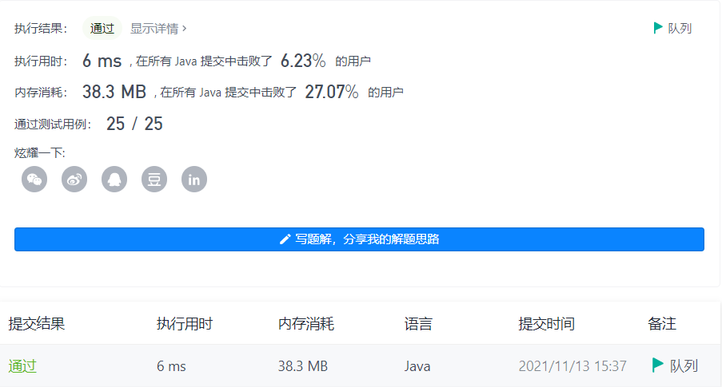
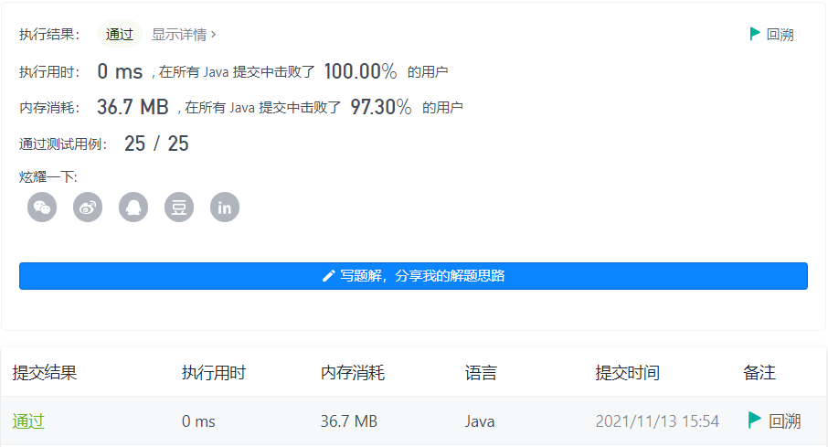

#### 17. 电话号码的字母组合

链接：https://leetcode-cn.com/problems/letter-combinations-of-a-phone-number/

标签：**字符串、回溯**

> 题目

给定一个仅包含数字 2-9 的字符串，返回所有它能表示的字母组合。答案可以按 任意顺序 返回。

给出数字到字母的映射如下（与电话按键相同）。注意 1 不对应任何字母。

 

示例 1：

```java
输入：digits = "23"
输出：["ad","ae","af","bd","be","bf","cd","ce","cf"]
```

示例 2：

```java
输入：digits = ""
输出：[]
```

示例 3：

```java
输入：digits = "2"
输出：["a","b","c"]
```


提示：

- 0 <= digits.length <= 4
- digits[i] 是范围 ['2', '9'] 的一个数字。

> 分析

解法1：可以使用队列求解。依次把号码两两进行组合放入队列，直到所有号码组合完毕后再把队列里的元素放到结果集返回即可。

解法2：回溯。

> 编码

解法1：

```java
class Solution {
    public List<String> letterCombinations(String digits) {
        List<String> list = new ArrayList<>();
        if (digits.length() == 0) {
            return list;
        }

        String[] str = {"abc", "def", "ghi", "jkl", "mno", "pqrs", "tuv", "wxyz"};
        Queue<String> queue = new LinkedList<>();
        // 把第一个号码的字符放入队列
        for (char c : str[digits.charAt(0) - '2'].toCharArray()) {
            queue.offer(c + "");
        }

        int index = 0;
        while (!queue.isEmpty()) {
            int size = queue.size();
            index++;
            
            for (int i = 0; i < size; i++) {
                String t = queue.poll();
                // 如果index超过digits的长度，说明队列里的元素已经组合了所有的号码，直接加入结果集
                if (index < digits.length()) {
                    // 把第index个号码对应的字符拼接到组合里
                    for (char c : str[digits.charAt(index) - '2'].toCharArray()) {
                        queue.offer(t + c + "");
                    }
                } else {
                    list.add(t);
                }
            }
        }

        return list;
    }
}
```



解法2：

```java
class Solution {
    public List<String> letterCombinations(String digits) {
        List<String> list = new ArrayList<>();
        if (digits.length() == 0) {
            return list;
        }

        String[] str = {"abc", "def", "ghi", "jkl", "mno", "pqrs", "tuv", "wxyz"};
        back(list, 0, digits, new StringBuilder(), str);
        return list;
    }

    private void back(List<String> list, int index, String digits, StringBuilder str, String[] s) {
        if (index == digits.length()) {
            list.add(str.toString());
            return;
        }

        String t = s[digits.charAt(index) - '2'];
        for (int i = 0; i < t.length(); i++) {
            str.append(t.charAt(i));
            back(list, index + 1, digits, str, s);
            // 移除末尾的
            str.deleteCharAt(str.length() - 1);
        }
    }
}
```

